## 1 在接口自动化的一个场景里面，个别接口需要使用不同的环境去运行，该怎么处理？
!!! ms-abstract ""
    可以通过添加自定义请求的方式实现。

## 2 接口传参需要使用随机数，有哪些内置方法？
!!! ms-abstract ""
    可以参考使用 JMeter 内置函数或者 Mock.js 函数生成随机值。请参考[内置函数](../user_manual/api_test/functions.md)

## 3 接口自动化多场景如何进行批量运行？
!!! ms-abstract ""
    在场景列表选中场景，点击【···】弹出下拉框，选择【批量运行】。

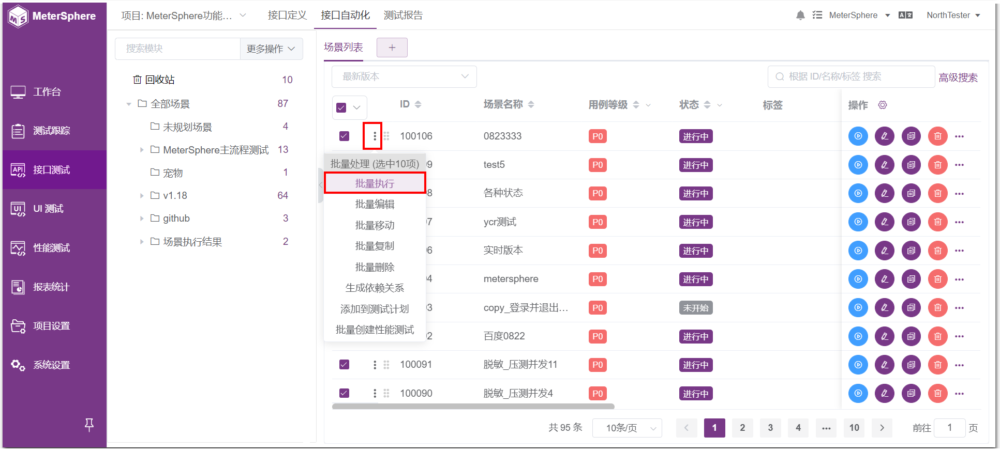{ width="900px" }

## 4 接口测试如何支持上传文件的接口吗？
!!! ms-abstract ""
    根据接口要求的请求体类型，选择 `form-data`、`x-www-form-urlencoded` 格式的请求体，参数类型选择 `file`，选择要添加的文件。也可以使用 `binary` 格式的请求体，直接选择要添加的文件。

{ width="900px" }

## 5 接口自动化中模块之间是否支持共享 cookie?
!!! ms-abstract ""
     环境配置-http 配置，支持按模块不同环境。同一模块下不同场景可以开启共享 cookie，不同模块不支持共享 cookie。<br />

## 6 接口测试中，期望结果不为空，如何写断言？
!!! ms-abstract ""
    可以在期望值中使用匹配任意非空字符的正则表达式 `\S+` 进行判断。

## 7 对SQL请求，如何断言？
!!! ms-abstract ""
    SQL请求的断言可通过如下步骤进行：

    - 配置“存储结果”和“按列存储”，存储数据。
    - 配置SQL脚本，取出需要断言的参数。
    - 添加脚本断言，判断存储 SQL 结果数据的变量的变量值。
    - 可参考[MeterSphere 数据库提取参数和断言](https://kb.fit2cloud.com/?p=364ab4d8-717a-4aee-bb90-0224d0f1dae0)

## 8 全局变量和场景变量里，包含相同变量名的变量，优先级如何判断？
!!! ms-abstract ""
    当全局变量和场景变量变量名相同时，优先使用场景变量。

## 9 场景中使用引用方式导入接口，但参数又需要重写，应该如何处理？
!!! ms-abstract ""
    接口导入场景有两种方式，第一种方式是复制，复制的接口可以在场景中修改参数；第二种方式是引用，引用的接口只能在接口定义中进行修改，修改完成后会自动同步到场景里。

## 10 场景中添加了条件控制器，且匹配失败了，为什么后续的接口还会执行？
!!! ms-abstract ""
    后续的将接口拖入到条件控制器下成为子步骤才有效。

## 11 接口测试中，如何获取当前的时间来做为变量？
!!! ms-abstract ""
    可以使用 `${__time()}` 内置函数。

## 12 如何创建 SQL 协议的接口测试？
!!! ms-abstract ""
    具体操作请参考：https://brucelong.blog.csdn.net/article/details/110133647 。

## 13 接口自动化测试，一个项目下的不同接口场景，是否可以引用同一个脚本？
!!! ms-abstract ""
    可以使用公共代码片段。可以在“系统设置” - “项目管理”，给指定的项目上传jar包，然后在项目设置-自定义代码片段下编写脚本，之后此项目下的不同场景就可以引用。

## 14 场景变量的类型为随机数，但执行过程中为什么没有实际生成？
!!! ms-abstract ""
    请检查配置的随机数长度，随机数长度需要在 MeterSphere 限定范围内。

## 15 如何通过变量引用 CSV 数据？
!!! ms-abstract ""
    在场景编辑页面，点击场景变量添加 CSV 类型的场景变量。具体操作参考 [场景变量配置](../user_manual/api_test/api_automation.md) 。

## 16 接口自动化里，同一场景下是否支持配置多个接口域名？
!!! ms-abstract ""
    在环境配置里面，可以分别按接口所属模块，或者接口路径这两种方式，来设计和匹配不同接口对应的域名。

{ width="900px" }
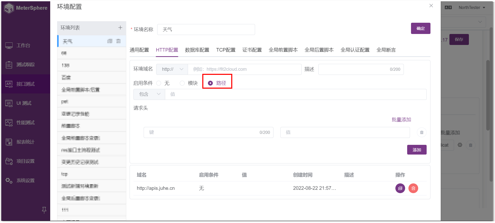{ width="900px" }

## 17 请求里面涉及到了转发重定向，如何获取接口返回的code？
!!! ms-abstract ""
    在接口的【请求参数】区域的【其他设置】页面中，取消勾选 【跟随重定向】选项。

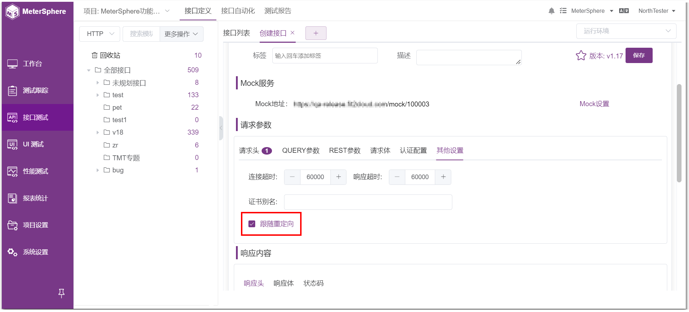{ width="900px" }

## 18 接口自动化批量执行，是并行还是串行？
!!! ms-abstract ""
    接口自动化批量执行同时支持串行和并行两种方式，可以在选择运行场景后，在 `运行配置` 弹窗进行选择。

{ width="900px" }
{ width="900px" }

## 19 批量执行接口自动化，是否可以按场景单独显示测试报告？
!!! ms-abstract ""
    在 `运行配置` 弹窗的 `其他配置` 选项中选择生成 `独立报告`。

{ width="900px" }
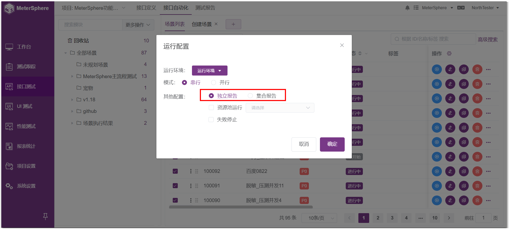{ width="900px" }

## 20 接口自动化选择多场景同时运行时，可以把执行结果整合成一个测试报告吗？
!!! ms-abstract ""
    在【运行配置】弹窗的 【其他配置】选项中选择生成【集合报告】。

{ width="900px" }
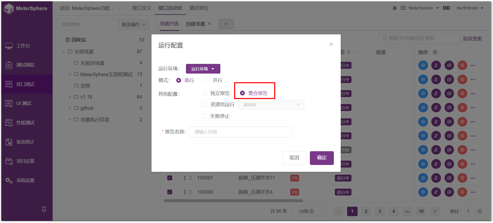{ width="900px" }

## 21 接口定义模块，编辑接口的页面，如何保存？
!!! ms-abstract ""
    在编辑接口页面“基础信息”区域，点击测试按钮后面的向下按钮，点击【更新接口】选项即可。

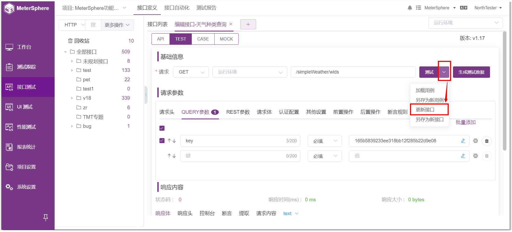{ width="900px" }

## 22 执行接口报错：`Non HTTP response code: java.net.SocketTimeoutException`
!!! ms-abstract ""
    在接口【其他设置】中增加的连接超时时间。

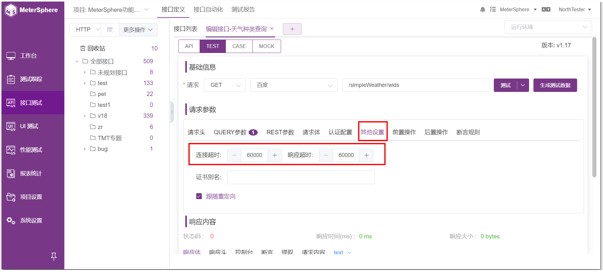{ width="900px" }

## 23 接口定义里的单接口，可以批量执行吗？
!!! ms-abstract ""
    目前可以通过接口定义模块的CASE列表来批量执行用例。

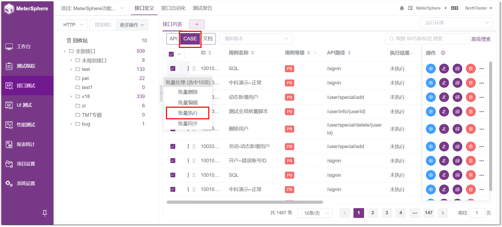{ width="900px" }
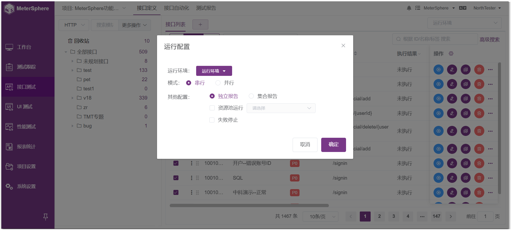{ width="900px" }

## 24 接口测试模块里，目前除了现有的HTTP、TCP、SQL、DUBBO，还支持其他协议吗？
!!! ms-abstract ""
    1.13 版本已经通过插件的方式实现了对 MQTT 协议的支持，该插件是企业版的功能，在 MeterSphere 【系统设置-系统-插件管理】中上传。

## 25 MeterSphere 可以直接在 IDE 中同步 API 吗？
!!! ms-abstract ""
    MeterSphere 已支持 IDEA API同步插件，详细使用方法见[metersphere-idea插件](../user_manual/plugin_use/idea_plugin.md)。

## 26 接口自动化场景里可以跨项目引用接口/用例吗？
!!! ms-abstract ""
    支持跨项目引用接口、用例、场景。

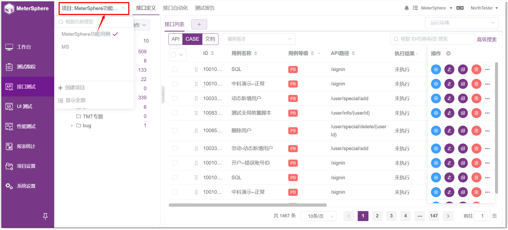{ width="900px" }

## 27 快捷调试的时候，一直转圈等待是什么原因?
!!! ms-abstract ""
     MeterSphere 的服务器到被测服务的地址网络不通，可在 MeterSphere 上 telnet 被测服务端口检查网络。

## 28 进行接口 case 调试时，调用不同控制台信息显示连接某地址超时，如何排查？
!!! ms-abstract ""
    这种情况大概率是网络不通造成的，可以使用 curl 命令在 ms-node-controller 容器和服务器上进行测试；

## 29 在接口调试时使用新的域名，在Linux的host文件中添加了域名解析，但依然调试不通，如何排查？
!!! ms-abstract ""
    因为 node-controller 容器中无法解析出域名，因此需要进入到 node-controller 容器中host文件中进行配置，然后重启 node-controller 容器。

## 30 如何循环取出列表变量的每一个值？
!!! ms-abstract ""
    结合循环控制器和计数器取值。参考方法[接口测试如何使用多个List进入ForEach循环控制器](https://bbs.fit2cloud.com/t/topic/399/3) 

## 31 接口响应内容为 Unicode 字符导致中文显示为乱码，如何处理？
!!! ms-abstract ""

    **方法1：** 在后置脚本中选择BeanShell语言处理编码，然后写入prev.setDataEncoding("UTF-8");  
    **方法2：** 在后置脚本中选择BeanShell，然后写入如下代码：
    ```
    String response_value=new String(prev.getResponseData(),"UTF-8");
    char aChar;
    int num= response_value.length();
    StringBuffer outBuffer=new StringBuffer(num);
    for(int x =0; x <num;){
        aChar= response_value.charAt(x++);
        if(aChar=='\\'){
            aChar= response_value.charAt(x++);
            if(aChar=='u'){
                int value =0;
                for(int i=0;i<4;i++){
                    aChar= response_value.charAt(x++);
                    switch(aChar){
                        case'0':
                        case'1':
                        case'2':
                        case'3':
                        case'4':
                        case'5':
                        case'6':
                        case'7':
                        case'8':
                        case'9':
                            value=(value <<4)+aChar-'0';
                            break;
                        case'a':
                        case'b':
                        case'c':
                        case'd':
                        case'e':
                        case'f':
                            value=(value <<4)+10+aChar-'a';
                            break;
                        case'A':
                        case'B':
                        case'C':
                        case'D':
                        case'E':
                        case'F':
                            value=(value <<4)+10+aChar-'A';
                            break;
                        default:
                            throw new IllegalArgumentException(
                                    "Malformed   \\uxxxx  encoding.");}}
                outBuffer.append((char) value);}else{
                if(aChar=='t')
                    aChar='\t';
                else if(aChar=='r')
                aChar='\r';
                else if(aChar=='n')
                aChar='\n';
                else if(aChar=='f')
                aChar='\f';
                outBuffer.append(aChar);}}else
            outBuffer.append(aChar);}
    prev.setResponseData(outBuffer.toString());
    ```

## 32 控制台中文输出乱码，如何处理？
!!! ms-abstract ""
    使用UTF编码，log.info(u"MeterSphere 一站式持续测试平台")。

## 33 接口测试是否可以导出到 JMeter？
!!! ms-abstract ""
    可以勾选对应的场景或接口，导出为 JMX 格式，然后再用 JMeter 打开 JMX 文件

## 34 MeterSphere 中 CSV 文件的主要应用场景有哪些？
!!! ms-abstract ""

    - 在接口自动化中可以将 CSV 文件作为批量传参文件可以用作场景变量使用，配合循环控制器使用。
    - 在性能测试中作为参数被引用。

## 35 场景中如何使用 CSV 文件参数？
!!! ms-abstract ""
    在场景变量中添加 CSV 文件，在请求中通过 ${CSV的文件列名} 进行引用。 

## 36 前置/后置脚本如何引用外部 jar 包？
!!! ms-abstract ""
    在项目设置-文件管理中上传 jar 包之后，在前置/后置脚本中使用 import 即可引用。

## 37 后置脚本中如何引用 js 文件？
!!! ms-abstract ""
    将 js 文件上传到服务器 /opt/ms/data/目录下，在后置脚本中选择 JavaScript，通过 load 引用 js文件：`load(“/opt/ms/data/xx.js”)`。

## 38 HTTP 协议接口支持哪些文件格式导入？
!!! ms-abstract ""
    HTTP 协议支持五种文件格式：MeterSphere格式、Postman格式、Swagger格式、HAR格式、JMeter格式：

    - MeterSphere 格式：通过 MeterSphere 接口测试页面或者浏览器插件导出的 json 格式文件。
    - Postman 格式：支持 Postman Collection v2.1 格式的 json 文件，通过 Postman 导出测试集合。
    - Swagger 格式：支持 Swagger 2.0 与 3.0 版本的 json 文件，通过 Swagger 页面导出或者URL直接导入。
    - HAR 格式：通过浏览器的开发者工具导出 HAR 格式文件。
    - JMeter 格式：支持 JMeter5.2-5.4 版本的 JMX 文件，通过 JMeter 生成 JMX 文件。

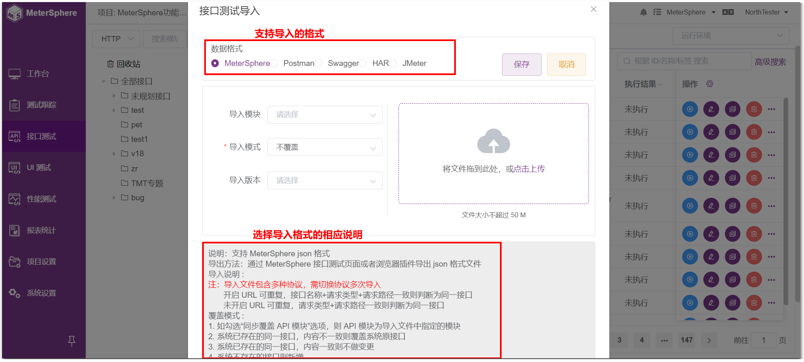{ width="900px" }

## 39 TCP 协议接口支持哪些文件格式导入？
!!! ms-abstract ""
    TCP 协议支持三种文件格式： MeterSphere格式、JMeter格式、ESB格式：

    - MeterSphere 格式：通过 MeterSphere 接口测试页面或者浏览器插件导出的 json 格式文件 <br>
    - JMeter 格式：支持 JMeter5.2-5.4版本的 JMX 文件，通过 JMeter 生成 JMX 文件 <br>
    - ESB 格式：支持 ESB 模版的 xlsx 文件（支持模版下载/上传）<br>

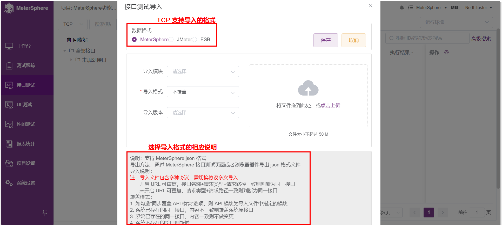{ width="900px" }

## 40 SQL 协议接口支持哪些文件格式导入？
!!! ms-abstract ""
    SQL 协议支持两种文件格式：MeterSphere格式、JMeter格式：

    - MeterSphere 格式：通过 MeterSphere 接口测试页面或者浏览器插件导出的 json 格式文件 <br>
    - JMeter 格式：支持 JMeter5.2-5.4 版本的 JMX 文件，通过 JMeter 生成 JMX 文件 <br>

{ width="900px" }

## 41 DUBBO 协议接口支持哪些文件格式导入？
!!! ms-abstract ""
    DUBBO 协议接口支持两种文件格式：MeterSphere格式、JMeter格式：

    - MeterSphere 格式：通过 MeterSphere 接口测试页面或者浏览器插件导出的 json 格式文件。
    - JMeter 格式：支持 JMeter5.2-5.4 版本的 JMX 文件，通过 JMeter 生成 JMX 文件。

{ width="900px" }

## 42 MeterSphere 根据什么规则判断名称相同或 URL 相同的接口是否为同一接口？
!!! ms-abstract ""

    - TCP、SQL、DUBBO 请求，同项目同模块同版本下，接口名称相同就是同一接口
    - 针对HTTP请求，同项目同模块同版本下，分为接口定义未开启 url 可重复和已开启 url 可重复两种情况

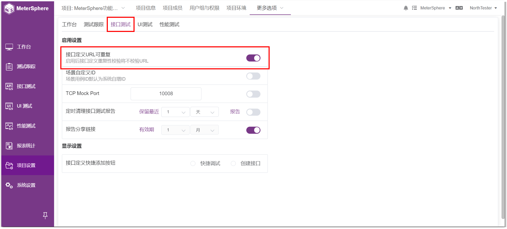{ width="900px" }

!!! ms-abstract ""
    - 未开启 URL 重复：请求类型+路径相同则为同一接口，如：

{ width="900px" }

!!! ms-abstract ""
    - 开启 URL 重复：接口名称+请求类型+路径相同则为同一接口，如：

{ width="900px" }

## 43 接口导入的详细逻辑是什么？
!!! ms-abstract ""
    接口导入主要涉及各类条件的判断，详细逻辑见下图：

{ width="900px" }

## 44 配置了定时任务，没有在钉钉群发消息？
!!! ms-abstract ""

    - 确认消息通知是否正确填写。
    - 定时任务是手动执行，不会发送消息。

## 45 选择环境名称后，请求内容里只有http://接口，没有使用到在环境配置的ip和端口，应该如何进行？
!!! ms-abstract ""
    在环境配置处，不选择“模块”或者“路径”，选择“无”即可

## 46 接口测试断言成功，为什么用例显示未通过？
!!! ms-abstract ""
    如果响应码不是200，需要勾选"忽略状态"忽略状态码的判断。

## 47 在后置脚本中如何获取响应结果？
!!! ms-abstract ""
    prev.getResponseDataAsString()

## 48 接口测试中导入 JMeter 脚本后，没有任何请求内容？
!!! ms-abstract ""
    使用 JMeter 打开 jmx 文件，确认接口是否被禁用， 如禁用手动开启保存后再导入。

## 49 后台日志报错：`ERROR StandardJMeterEngine JDBC data source already defined for: mysql`
!!! ms-abstract ""
    查看数据库-数据源，修改最大连接数。

## 50 接口响应内容过大（约4M）导致请求卡住不动，如何处理？
!!! ms-abstract ""
    当响应内容过大时，在 gateway 日志中可以发现对应提示日志： `Max frame length of 10485760 has been exceeded`。 在 /opt/metersphere/conf/metersphere.properties 添加属性：spring.cloud.gateway.httpclient.websocket.max-frame-payload-length=自定义大小，修改完后 msctl reload 重新加载在配置文件即可。

