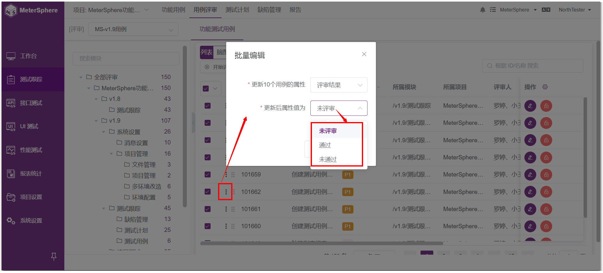
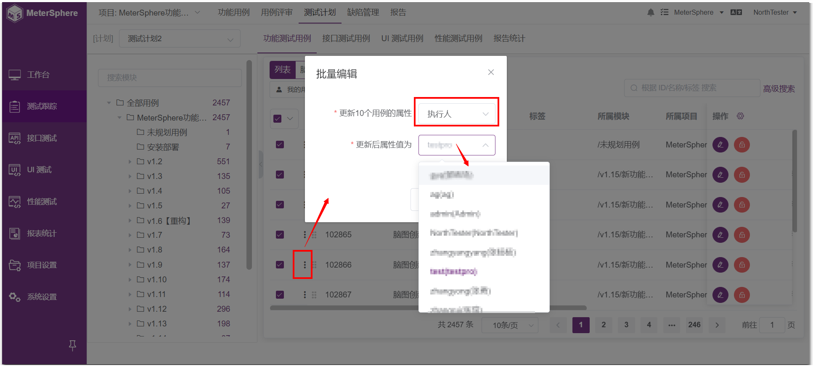
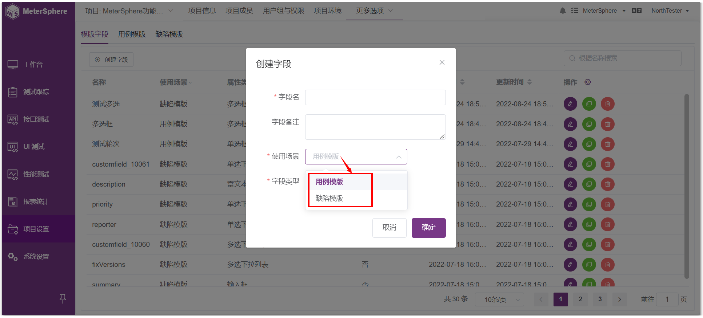
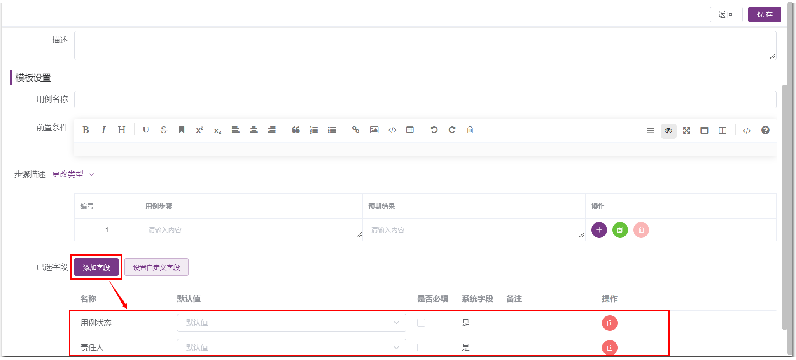
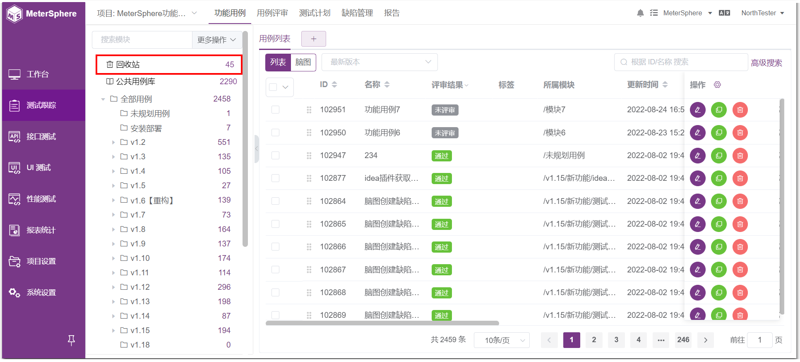
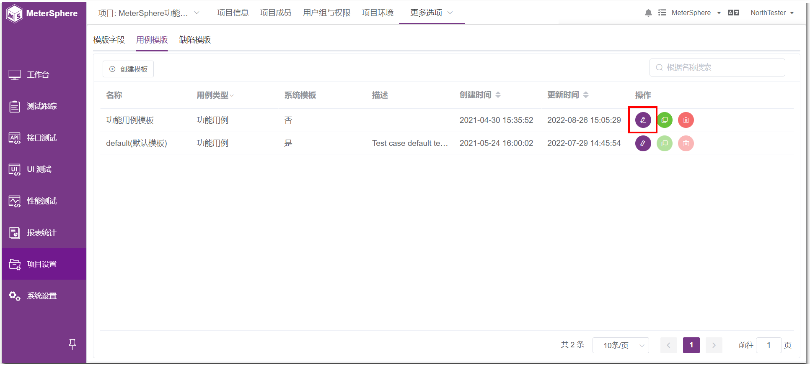
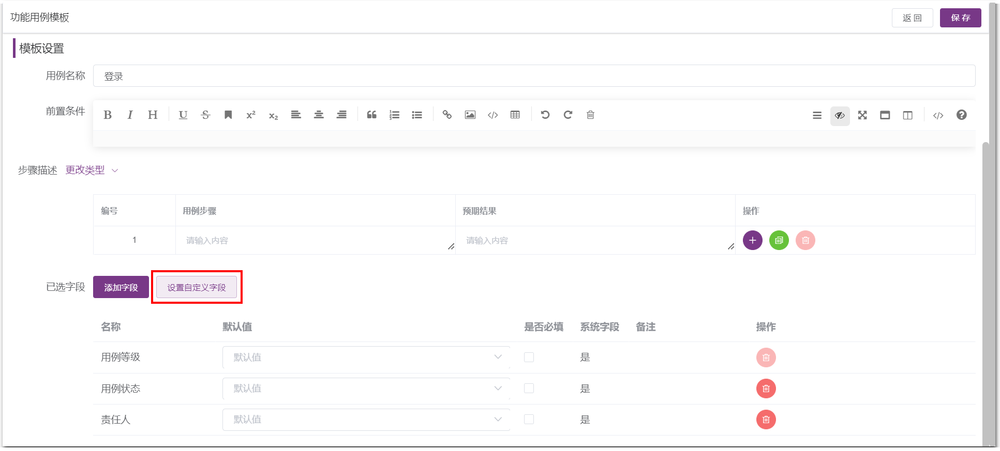

## 1 MeterSphere 中测试计划具体的场景是什么？
!!! ms-abstract ""
    参考文章： [产品解读丨MeterSphere中测试计划的场景设计与实现](https://mp.weixin.qq.com/s/hbhBEXMzphVjivmHXY3PjA)。

## 2 测试跟踪模块，用例评审如何进行批量处理？
!!! ms-abstract ""
    选中测试评审用例列表中需要批量处理的用例，点击【···】弹出下拉框，选择批量编辑，可以批量设置评审结果。

{ width="900px" }

## 3 测试计划里，如何批量分配执行人？
!!! ms-abstract ""
    选中测试计划用例列表中需要批量处理的用例，点击【···】弹出下拉框，选择批量编辑，可以分配执行人。

{ width="900px" }

## 4 测试计划执行定时任务，是否会自动触发接口测试和性能测试？定时任务添加后如何删除？
!!! ms-abstract ""
    测试计划的定时任务支持关联管理接口测试、性能测试并定时触发；配置定时任务后，关闭 SCHEDULER 开关即可取消定时任务。

## 5 测试用例可以自定义显示字段吗？
!!! ms-abstract ""
    在测试用例列表，点击【操作】列中的齿轮按钮进行配置。

{ width="900px" }

## 6 如果集成了 JIRA，缺陷状态可以同步更新 MeterSphere 吗？
!!! ms-abstract ""
    开源版仅支持单向同步，即 MeterSphere 缺陷同步到第三方平台。企业版支持双向同步，即 MeterSphere 缺陷同步到第三方平台，第三方平台上的缺陷同步到 MeterSphere

## 7 缺陷管理自定义字段，如何跟 JIRA 端的字段关联？
!!! ms-abstract ""
    在 Jira 里查看 network，找到对应的自定义字段的字段名称，然后到 MeterSphere 缺陷模版里设置上对应的 api 字段名。

## 8 测试用例可以自定义添加字段吗？
!!! ms-abstract ""
    在【项目设置-更多选项-模版管理-模板字段】，可以创建模板字段，创建时选择用例模版，保存成功后打开用例模版，添加创建的模板字段。然后在编写用例的页面就会出现模板字段。

{ width="900px" }

{ width="900px" }

## 9 如何找回误删除的测试用例？
!!! ms-abstract ""
    删除的测试用例并不会立即删除，而是移动到【回收站】中，可以在【测试跟踪-测试用例】模块，点击【回收站】找回。

{ width="900px" }

## 10 测试用例页面的字段如何增加自定义字段？
!!! ms-abstract ""

    - 在【项目设置-模版管理-用例模版】页面中，选择要添加字段的用例模版，打开【编辑用例模版】页面。
    - 在【编辑用例模版】页面，点击【设置自定义字段】按钮打开【创建字段】对话框，在对话框中填写字段名称、备注，选择【字段类型】，点击【确定】保存。
{ width="900px" }
{ width="900px" }
{ width="900px" }

## 12 提交缺陷页面的字段如何进行自定义配置？
!!! ms-abstract ""
    采用用例模版实现自定义字段。

    - 在【项目设置-模版管理-缺陷模版】页面中，选择要添加字段的缺陷模版，打开【编辑缺陷模版】页面。
    - 在【编辑缺陷模版】页面，点击【设置自定义字段】按钮打开【创建字段】对话框，在对话框中填写字段名称、备注，选择【字段类型】，点击【确定】保存。

## 13 在 JIRA、TAPD、禅道上已创建的缺陷，MS上点击“同步缺陷”，未成功同步
!!! ms-abstract ""
    项目与这些工具设置了集成后，开源版仅支持单向同步，即 MeterSphere 缺陷同步到第三方平台。企业版支持双向同步，即 MeterSphere 缺陷同步到第三方平台，同时也支持第三方平台上的缺陷同步到 MeterSphere。

## 14 测试用例模版添加的自定义字段如何在列表展示？
!!! ms-abstract ""
    在测试用例列表中，点击【操作】列中的齿轮按钮进行配置。

{ width="900px" }

## 15 同一个测试计划，既包含接口测试用例，也包含场景用例时，执行顺序是怎样的？
!!! ms-abstract ""
    
    - 不同类型的用例之间（接口用例、场景用例和性能用例等）没有先后关系，是并行执行。
    - 同类型的多个测试根据运行时配置执行（串行或者并行）。

## 16 从本地 xmind 复制数据粘贴到 MeterSphere 用例脑图直接保存后没有数据
!!! ms-abstract ""
    需要将相应的数据标记为模块或者用例才能保存。

## 17 MS 集成 TAPD，在 MS 平台提交缺陷时上传图片文件，但 TAPD 中无法正确显示图片
!!! ms-abstract ""
    
    问题原因：
    浏览器的默认安全策略导致的，因为图片实际上是放在禅道的，MS 是https的，TAPD 的地址是http，访问 http 的禅道会自动转成 https。
    
    解决方法：
    MS平台【系统设置-系统-系统参数设置-基本配置-当前站点URL】，需要配置成 https 的地址
    

## 18 MS集成禅道，在 MS平台上 项目ID 填写正确，检查时提示`ID不存在或者其他错误`，如何解决？
!!! ms-abstract ""
    可能原因包括：

    - v2.4 版本之后，服务集成修改为插件方式，禅道插件版本和当前 MS 版本不一致。
    - 没有对应产品或者项目的权限，或者有权限但是需要填产品 ID，实际填了项目 ID。
    - 缺少配置 $config->features->apiGetModel。
    - 襌道里 api 超级调用模式有没有授权。

    解决方法： 

    - 在 github上下载和 MS 版本一致的插件[metersphere-platform-plugin](https://github.com/metersphere/metersphere-platform-plugin) 并上传到【系统设置-插件管理】，用法参考[服务集成插件](../user_manual/plugin_use/service_integration_plugin.md)。
    - 在项目编辑弹框-项目ID 后有提示说明，按照配置说明填写对应 ID。 
    - 在禅道安装路径中：${安装路径}/zentao/config/ 目录下 my.php (如果没有，新建 my.php 文件)中添加如下内容：`$config->features->apiGetModel = true;`然后重启禅道服务器：`/opt/zbox/zbox restart`。 
    - 在禅道 web 端的【组织-权限-权限维护-API 接口】中，勾选“超级model调用接口”。

