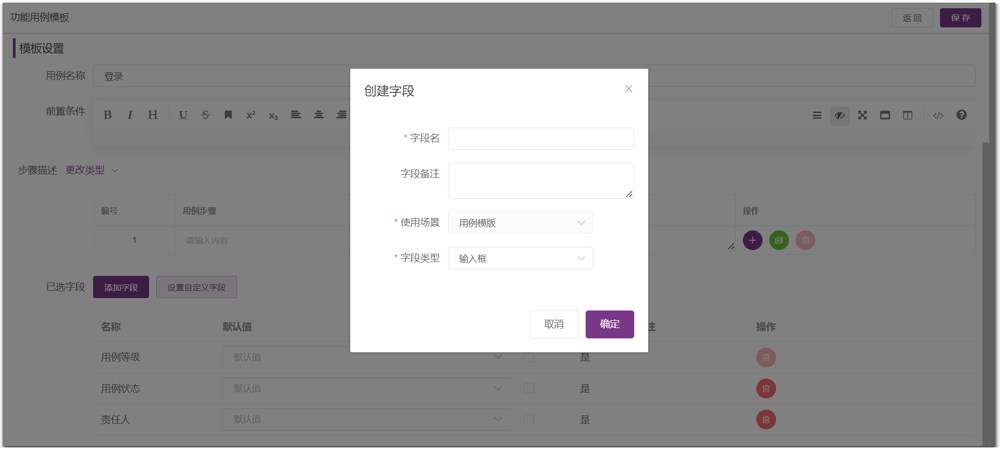

## 1 MeterSphere 中测试计划具体的场景和优势是什么？

参考文章： [产品解读丨MeterSphere中测试计划的场景设计与实现](https://mp.weixin.qq.com/s/hbhBEXMzphVjivmHXY3PjA)。

## 2 测试跟踪模块，用例评审是否支持批量处理？

支持。选中测试评审用例列表中需要批量处理的用例，点击【···】弹出下拉框，选择批量编辑，可以批量设置评审结果。

## 3 测试计划里，是否支持批量分配执行人？

支持。选中测试计划用例列表中需要批量处理的用例，点击【···】弹出下拉框，选择批量编辑，可以分配执行人。

## 4 测试计划执行定时任务，是否会自动触发接口测试和性能测试？定时任务添加后如何删除？

测试计划的定时任务支持关联管理接口测试、性能测试并定时触发；配置定时任务后，关闭SCHEDULER开关取消定时任务。

## 5 测试用例可以自定义显示字段吗？

可以，在测试用例列表，点击【操作】列中的齿轮按钮进行配置。

## 6 如果集成了 JIRA，缺陷状态可以同步更新 MeterSphere 吗？

开源版单向同步，即 MeterSphere 缺陷同步到第三方平台。企业版是双向同步，即 MeterSphere 缺陷同步到第三方平台，第三方平台上的缺陷同步到 MeterSphere

## 7 缺陷管理自定义字段，如何跟 JIRA 端的字段关联？

在 Jira 里查看 network，找到对应的自定义字段的字段名称，然后到 MeterSpherer 缺陷模版里设置上对应的 api 字段名。

## 8 测试用例可以自定义添加字段吗？

在【项目设置-更多选项-模版管理-模板字段】，可以创建模板字段，创建时选择用例模版，保存成功后打开用例模版，添加创建的模板字段。然后在编写用例的页面就会出现模板字段。

## 9 如果测试用例误删除了，还能找回来吗？

可以。在【测试跟踪-测试用例】模块，点击【回收站】找回。

## 10 编写测试用例页面的字段可以增加吗？
可以。

（1）在【项目设置】-【模版管理】-【用例模版】页面中，选择要添加字段的用例模版，打开【编辑用例模版】页面。

（2）在【编辑用例模版】页面，点击【设置自定义字段】按钮打开【创建字段】对话框，在对话框中填写字段名称、备注，选择【字段类型】，点击【确定】保存。

## 11 功能用例，用脑图在线编写用例，怎么直接在脑图里创建模块？
目前只能通过页面左侧的模块列表区域，创建新的模块。

## 12 提交缺陷页面的字段可以自己配置吗？
可以。类似给用例模版添加字段。
（1）在【项目设置】/【模版管理】/【缺陷模版】页面中，选择要添加字段的缺陷模版，打开【编辑缺陷模版】页面。

（2）在【编辑缺陷模版】页面，点击【设置自定义字段】按钮打开【创建字段】对话框，在对话框中填写字段名称、备注，选择【字段类型】，点击【确定】保存。

## 13 在 JIRA、TAPD、禅道上提交的缺陷可以同步到 MeterSphere 里面吗？
项目与这些工具设置了集成后，开源版单向同步，即 MeterSphere 缺陷同步到第三方平台。企业版是双向同步，即 MeterSphere 缺陷同步到第三方平台，第三方平台上的缺陷同步到 MeterSphere

## 14 测试用例模版添加的自定义字段可以在列表展示么？
可以。在 测试用例列表 - 点击【操作】列中的齿轮按钮进行配置。

## 15 同一个测试计划里，既包含 接口测试用例，也包含场景用例时，执行顺序是怎样的；
不同类型的用例并行执行；例如，接口用例、场景用例和性能用例之间没有先后关系，是并行的；同类型的多个测试根据运行时的配置串行或者并行

## 16 从本地 xmind 复制数据粘贴到 MeterSphere 用例脑图直接保存后没有数据
需要将相应的数据标记为模块或者用例才能保存