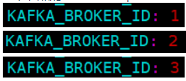
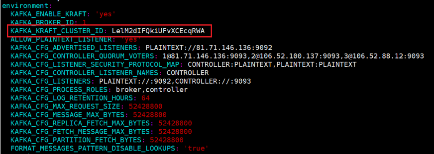
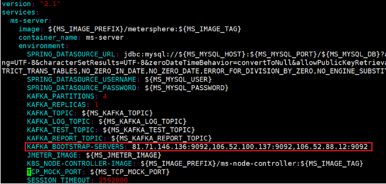
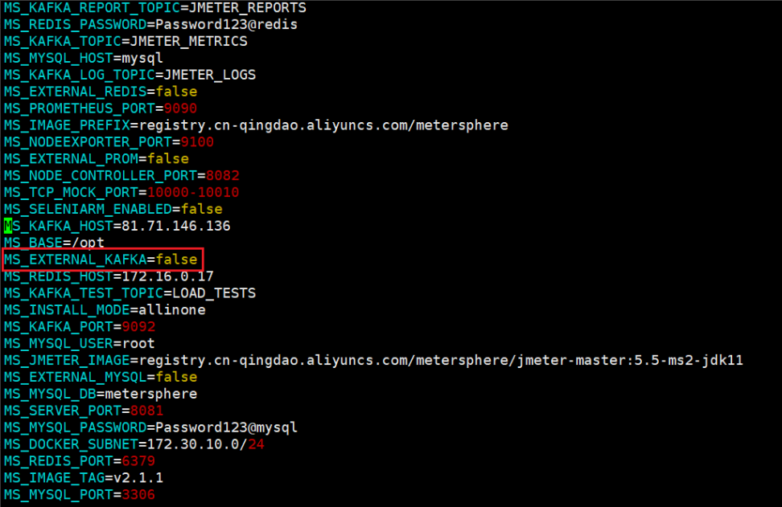

!!! ms-abstract ""
    Kafka 3.0 之前的架构: 元数据在 zookeeper 中，运行时动态选举 controller，由 controller 进行 Kafka 集群管理。kraft 模式架构: 不再依赖 zookeeper 集群，而是用三台 controller 节点代替 zookeeper，元数据保存在 controller 中，由 controller 直接进行 Kafka 集群管理。

## 1 kraft 架构
!!! ms-abstract ""
    - Kafka 不再依赖外部框架，而是能够独立运行。 <br>
    - controller 管理集群时，不再需要从 zookeeper 中先读取数据，集群性能上升。 <br>
    - 由于不依赖 zookeeper，集群扩展时不再受到 zookeeper 读写能力限制 controller 不再动态选举，而是由配置文件规定，这样我们可以有针对性的加强 controller 节点的配置。 <br>
    - 后续版本升级方便，不用和 zookeeper 一起维护。

## 2 docker-compose-kafka.yml
!!! ms-abstract ""
    docker-compose-kafka.yml 配置
    ```
    version: "2.1"
    services:
      kafka:
        image: '${MS_IMAGE_PREFIX}/kafka:3.2.0'
        container_name: kafka
        ports:
          - '${MS_KAFKA_PORT}:${MS_KAFKA_PORT}'
        healthcheck:
          test: ["CMD", "bash", "-c", "< /dev/tcp/localhost/9093"]
          interval: 6s
          timeout: 10s
          retries: 20
        restart: always
        environment:
          KAFKA_ENABLE_KRAFT: 'yes'
          KAFKA_BROKER_ID: 1
          ALLOW_PLAINTEXT_LISTENER: 'yes'
          KAFKA_CFG_ADVERTISED_LISTENERS: PLAINTEXT://${MS_KAFKA_HOST}:${MS_KAFKA_PORT}
          KAFKA_CFG_CONTROLLER_QUORUM_VOTERS: 1@127.0.0.1:9093
          KAFKA_CFG_LISTENER_SECURITY_PROTOCOL_MAP: CONTROLLER:PLAINTEXT,PLAINTEXT:PLAINTEXT
          KAFKA_CFG_CONTROLLER_LISTENER_NAMES: CONTROLLER
          KAFKA_CFG_LISTENERS: PLAINTEXT://:9092,CONTROLLER://:9093
          KAFKA_CFG_PROCESS_ROLES: broker,controller
          KAFKA_CFG_LOG_RETENTION_HOURS: 64
          KAFKA_CFG_MAX_REQUEST_SIZE: 52428800
          KAFKA_CFG_MESSAGE_MAX_BYTES: 52428800
          KAFKA_CFG_REPLICA_FETCH_MAX_BYTES: 52428800
          KAFKA_CFG_FETCH_MESSAGE_MAX_BYTES: 52428800
          KAFKA_CFG_PARTITION_FETCH_BYTES: 52428800
          FORMAT_MESSAGES_PATTERN_DISABLE_LOOKUPS: 'true'
        networks:
          - ms-network
      ms-data-streaming:
        depends_on:
          kafka:
            condition: service_healthy
    ```
    以 v2.1.0 版本为例，KAFKA_ENABLE_KRAFT: 'yes'，默认允许 kraft 集群模式，我们只需要把其他节点加入到集群中即可。需要修改的配置项包括 KAFKA_CFG_ADVERTISED_LISTENERS、KAFKA_CFG_CONTROLLER_QUORUM_VOTERS、KAFKA_BROKER_ID、ports。需要添加的配置项包括 KAFKA_KRAFT_CLUSTER_ID。

### 2.1 Broker ID 配置
!!! ms-abstract ""
    三个节点的 docker-compose-kafka.yml 文件中，KAFKA_BROKER_ID 值分别为1、2、3。<br>
{ width="900px" }{ width="600px" height:"80%"}

### 2.2 Broker 地址
!!! ms-abstract ""
    这个配置是 broker 对外暴露的地址，需要填写每个节点真实的 ip 和端口。<br>
{ width="900px" }

### 2.3 Controller 列表
!!! ms-abstract ""
    这个是所有的 controller 列表，三个配置文件都填一样。格式：1@ip1:9093，2@ip2:9093，3@ip3:9093
{ width="900px" }

### 2.4 Ports 配置
!!! ms-abstract ""
    docker-compose-kafka.yml 文件中，默认没有对外暴露 9093 端口，所以需要手动修改，暴露出来。
{ width="900px" }

### 2.5 集群 ID
!!! ms-abstract ""
    必须给集群配置一个集群ID，否则会报错：Unexpected error INCONSISTENT_CLUSTER_ID in VOTE response: InboundResponse。<br>
    默认没有该配置，所以需要手动添加，三个节点的配置保持一致。
{ width="900px" }

## 3 docker-compose-server.yml
!!! ms-abstract ""
    这里要配置多个 kafka 地址，service:ms-server 和 service:ms-data-streaming 中都要修改该配置，格式：ip1:9092，ip2:9092，ip3:9092。
{ width="900px" }

{ width="900px" }

## 4 .env 文件配置
!!! ms-abstract ""
    保持默认配置,依然使用内置 Kafka，保持 MS_EXTERNAL_KAFKA=false，只是在 docker-compose-kafka.yml 和 docker-compose-server.yml 中 Kafka 相关参数都写死了，没有引用 .env 中的环境变量。<br>
{ width="900px" }

!!! ms-abstract ""
    以上内容配置好之后，使用 msctl reload 命令重新加载配置文件，即可创建 kraft 集群。
{ width="900px" }

{ width="900px" }

{ width="900px" }