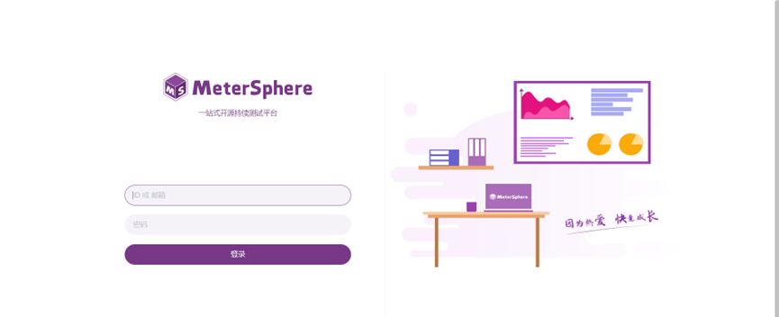

## 1 环境要求
!!! ms-abstract ""
	得益于 Docker 跨平台应用，MeterSphere 理论上可以部署在任何可以运行 Docker 的宿主机，包括 Windows 操作系统的主机。将以 Windows 10 为例，介绍如何在 Windows 操作系统通过 WSL 上安装 MeterSphere。


!!! ms-abstract "部署服务器要求："
    * 操作系统: 可运行 Docker 的 Windows 操作系统
    * CPU/内存: 最低要求 4C8G，推荐 8C16G (2.3.0版本及其之后的版本，最低配置 8C16G)
    * 磁盘空间: 200G

!!! ms-abstract "注意："
	* WSL 需要支持嵌套虚拟化，云虚拟机(Windows)可能不支持而导致无法安装 MeterSphere
## 2 安装部署
### 2.1 安装 WSL
!!! ms-abstract ""
	参考[在 Windows 10 上安装 WSL | Microsoft Docs](https://docs.microsoft.com/zh-cn/windows/wsl/install)进行 Windows 宿主机 WSL 的安装和配置。  

	使用管理员身份运行以下命令，然后重启操作系统。
	```
	dism.exe /online /enable-feature /featurename:Microsoft-Windows-Subsystem-Linux /all /norestart
	dism.exe /online /enable-feature /featurename:VirtualMachinePlatform /all /norestart
	```

	下载并安装 [适用于 x64 计算机的 WSL2 Linux 内核更新包](https://wslstorestorage.blob.core.windows.net/wslblob/wsl_update_x64.msi)

	以管理员身份执行以下命令，设置 WSL 默认版本：<br>
	```
	wsl --set-default-version 2
	```

### 2.2 安装 Ubuntu
!!! ms-abstract ""
	在 Windows 10 的应用商店里搜索"Ubuntu"并安装：
{ width="900px" }

### 2.3 检测 Ubuntu WSL 版本
!!! ms-abstract "以管理员身份执行："
	```
	wsl.exe -l -v
	```
{ width="900px" }

!!! ms-abstract ""
	示例中安装的 Ubuntu Name 为 "Ubuntu"， 如像上图出现 Ubuntu 版本为 1， 则继续执行命令：
	```
	wsl.exe --set-version Ubuntu 2
	```

	**出现下图结果即为成功：**
{ width="900px" }

### 2.4 Docker 安装与配置
!!! ms-abstract ""
	下载[Docker Desktop for Windows](https://desktop.docker.com/win/main/amd64/Docker%20Desktop%20Installer.exe)，双击 Docker Desktop Installer.exe 完成docker 的安装。


	Docker Desktop 安装完成后，进入 Settings 界面，选择 Resources 菜单下的 WSL INTEGRATION，按下图设置后，点击右下角的`Apply & Restart`。
{ width="900px" }

### 2.5 启动 Ubuntu
!!! ms-abstract ""
	在应用商店里，选择 Ubuntu，点击"启动"按钮启动 Ubuntu，并执行 `sudo su` 命令切换到 root 用户：
`
{ width="600px" }

### 2.6 检查 Docker 环境
!!! ms-abstract ""
	在 Ubuntu 命令行中执行命令`docker version`，如能像下图一样正常显示 docker 版本信息，则能正常执行 MeterSphere 后续的安装操作，如出现异常，则需要根据提示信息解决。
{ width="600px" }

### 2.7 下载安装包
!!! ms-abstract ""
	在 [飞致云开源社区](https://community.fit2cloud.com/#/products/metersphere/downloads) 或 [MeterSphere Github Release](https://github.com/metersphere/metersphere/releases) 下载 MeterSphere 最新版本的离线安装包。

### 2.8 解压安装包
!!! ms-abstract ""
	在 Ubuntu 中，以 root 用户执行如下命令：
	```
	# 假设安装包存放路径为 c:\metersphere-offline-installer-v2.10.0.tar.gz
	cd /mnt/c
	# 解压安装包
	tar zxvf metersphere-offline-installer-v2.10.0.tar.gz
	```

### 2.9 配置安装参数（可选）
!!! ms-abstract ""
	MeterSphere 支持以配置文件的形式来设置安装参数，如安装目录、服务运行端口、数据库配置参数等，安装前修改安装包中的 install.conf 文件可完成配置。具体说明见：[安装配置文件说明](../offline_installation/#42)。

### 2.10 执行安装脚本
!!! ms-abstract ""
	```
	# 进入安装包目录
	cd metersphere-offline-installer-v2.10.0
	# 运行安装脚本
	/bin/bash install.sh
	```

	安装成功后，使用 `msctl status` 查看后台服务状态，待所有服务运行状态都为 `healthy` 后，则通过浏览器访问 MeterSphere。

	```
	地址: http://目标服务器IP地址:服务运行端口
	用户名: admin
	密码: metersphere
	```
{ width="900px" }

{ width="900px" }


