MeterSphere 接口测试模块提供了接口定义、接口自动化等接口测试相关功能。
用户可以使用树状多级模块来分级分组管理项目下的接口列表，创建执行接口用例测试接口，组合编排多个接口用例进行场景自动化测试。

## 1 维护接口定义
进入【接口测试】->【接口定义】 页面。

### 1.1 导入 Swagger 接口文档
点击左侧【更多操作】下拉菜单中的【导入】按钮。

选择 Swagger 数据格式，选择 MeterSphere 模块，选择【导入模式】为不覆盖，选择【导入版本】，选择使用 URL 导入，并填入 Swagger 对应的 JSON 地址 `http://xxx.fit2cloud.com/v3/api-docs`，导入 API 接口。
!!! info "注意"
    【版本管理】为企业版 X-Pack 功能，如果是社区版，没有 【导入版本】选项。 
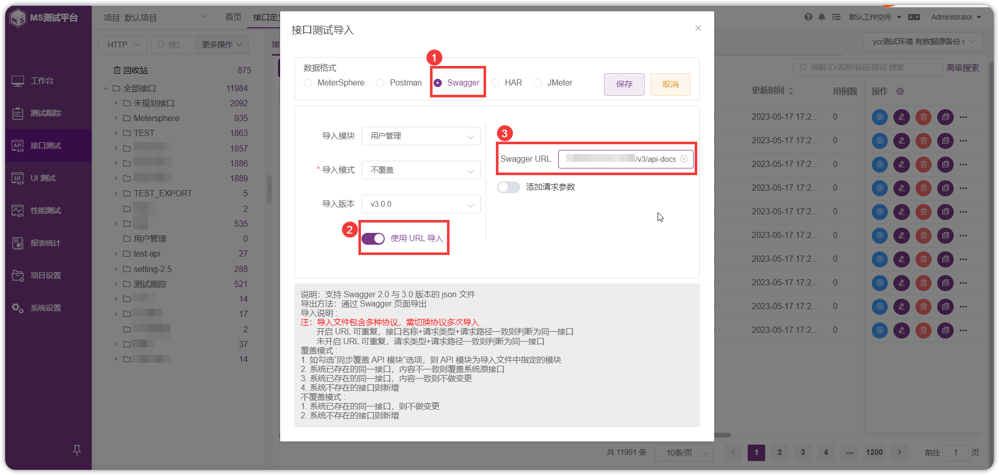

### 1.2 查看接口定义
导入 Swagger 文件之后，在接口列表中找到登录接口 `login_1` ，点击操作列中的【编辑】按钮，查看接口详情。
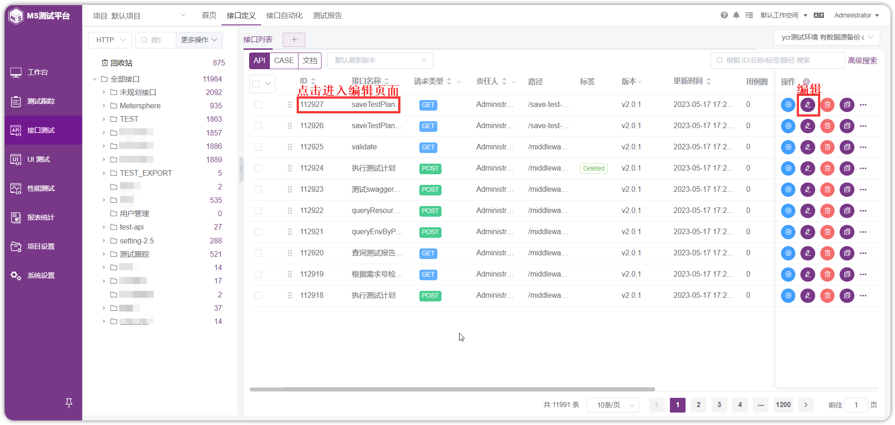

### 1.3 为项目添加测试环境
接口列表中仅记录了接口的相对 URL，当我们需要对某个接口进行测试时，需要先在该项目中添加针对该项目的测试环境信息。
点击左侧菜单栏【系统设置】->【项目管理】 页面。点击【创建环境】 按钮，填写环境名称及环境域名，点击确定保存测试环境信息。
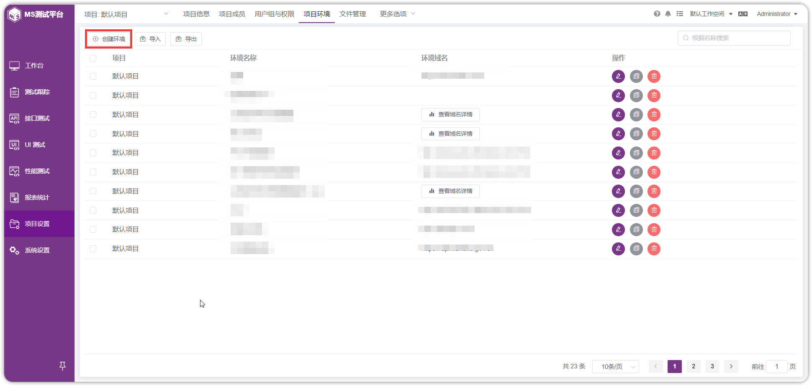

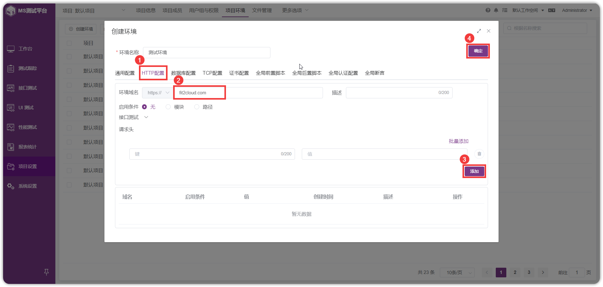

### 1.4 调试单个接口
在接口列表中找到 `login_1` 接口，点击操作列中的 【编辑】 按钮，进入接口详情页面。

点击界面上方的【TEST】按钮，进入接口测试页面。在接口测试页面选择接口执行环境，并填写接口所需的参数后，点击【测试】按钮发送该接口请求。

当接口请求完成后，可以在下方的响应内容中查看到本次接口请求的响应信息。
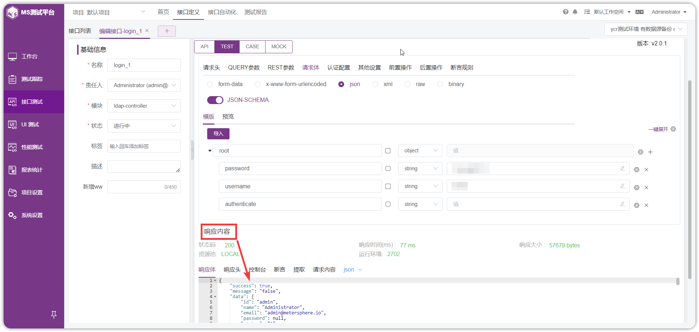

## 2 创建单接口用例
进入【接口测试】->【接口定义】页面。

### 2.1 新建单接口用例
在接口列表中找到 `login_1` 接口，点击操作列中的【CASE】按钮，打开该接口的用例列表页面。
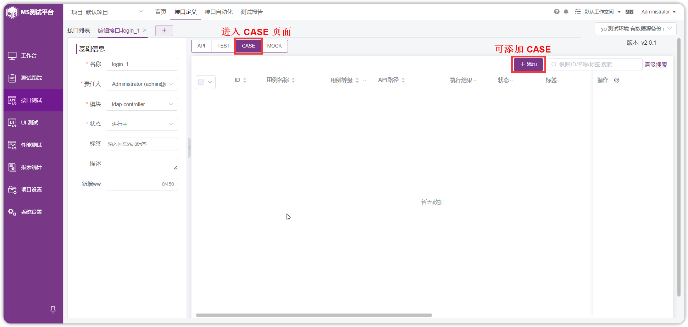

点击【添加】按钮，添加用例。

输入接口用例的名称及请求接口所需的其他参数后，点击右上角的【保存】按钮保存该接口用例。
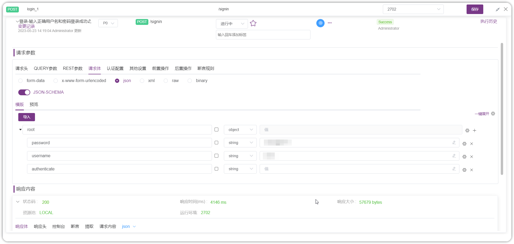

### 2.2 测试单接口用例
在单接口用例右上方选择【执行环境】，点击【执行】按钮调试单接口用例，执行结束后，展开用例详情查看响应内容。
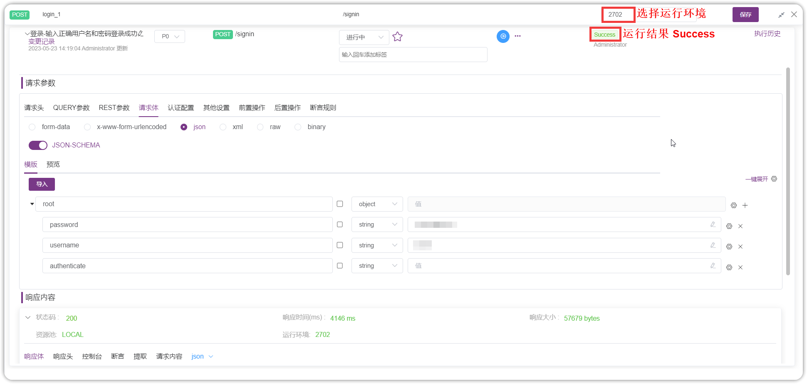

## 3 创建场景用例
进入【接口测试】->【接口自动化】页面。
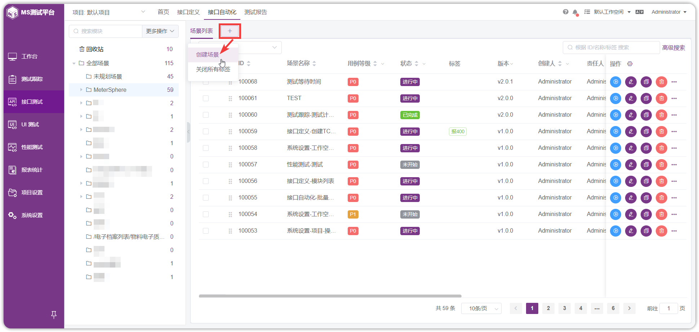

### 3.1 新建场景用例
在场景用例列表页面，点击左侧的模块树新建 `MeterSphere` 模块。

点击【创建场景】按钮新建一个 `获取用户列表` 的场景，该场景的目的是获取当前 MeterSphere 系统所有的用户列表信息，因为`获取用户列表`接口需要登录状态或者接口签名认证才可以正常请求，这里采用类似 Swagger 调试的方式，先获取`登录态`，再执行`获取用户列表`接口，这里需要分别导入`登录`和`获取用户列表`两个接口，同时需要勾选上【共享cookie】，填写完场景基本信息后，点击【保存】按钮保存该场景。
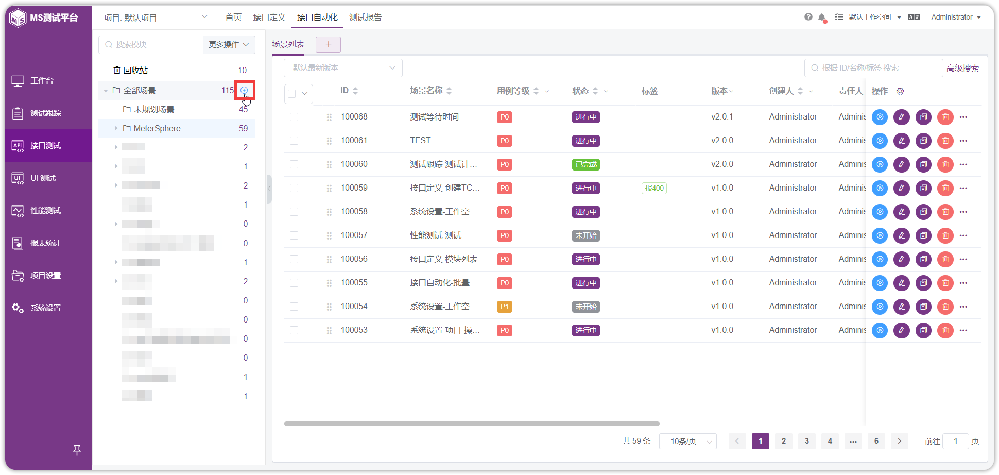

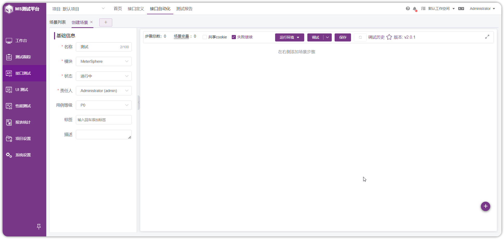

### 3.2 在场景用例中添加步骤
首先勾选【共享cookie】按钮，然后点击场景详情中右下角的【+】添加场景步骤按钮，在场景中一次添加如下几个步骤。

选择【接口列表导入】步骤，在弹出的接口列表中找到 `login_1` 接口进行添加。
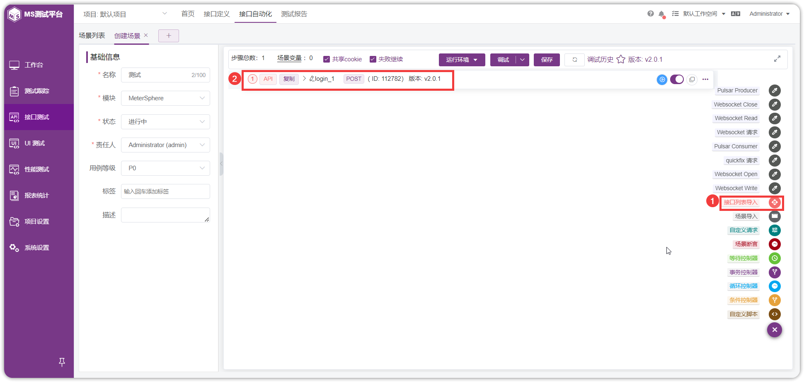

修改该接口请求中的 `login_1` 中的登录相关参数。
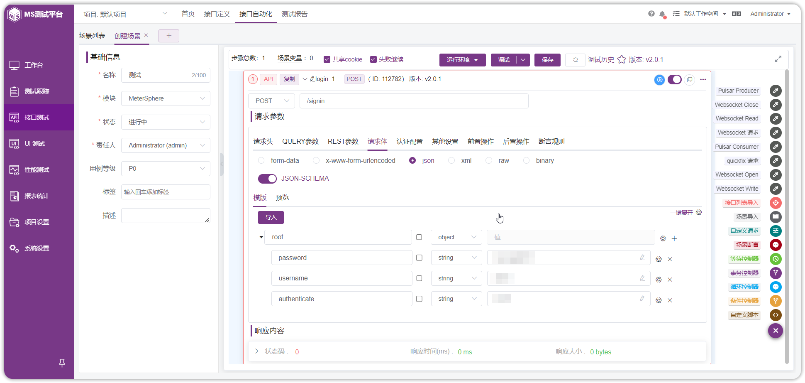

展开 `login_1` 接口的请求参数，切换到【后置操作】，在该页面添加一个名称为 `获取CSRF-TOKEN`的提取步骤，采用【推荐 JSONPath 提取】方式添加一个提取，在弹出的响应结果 Json 页面中，下拉到最底层，勾选名称为`csrfToken`的属性，JSONPath 表达式为 `$.data.csrfToken`。
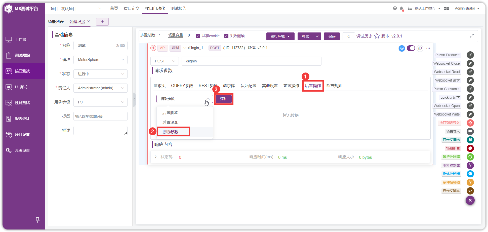

!!! info "注意"
    当前步骤需先手动执行成功，才可以使用`推荐 JSONPath 提取`方式。

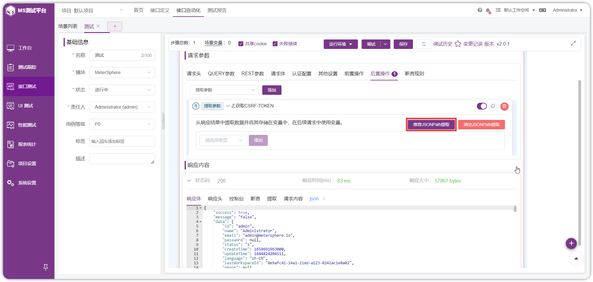

    
再次添加一个 【接口列表导入】 步骤，选择 `getUserList` 接口。修改请求头里的CSRF-TOKEN参数，设置为`${csrfToken}`，修改该接口请求中的REST参数 goPage 为1，pageSize 为10。
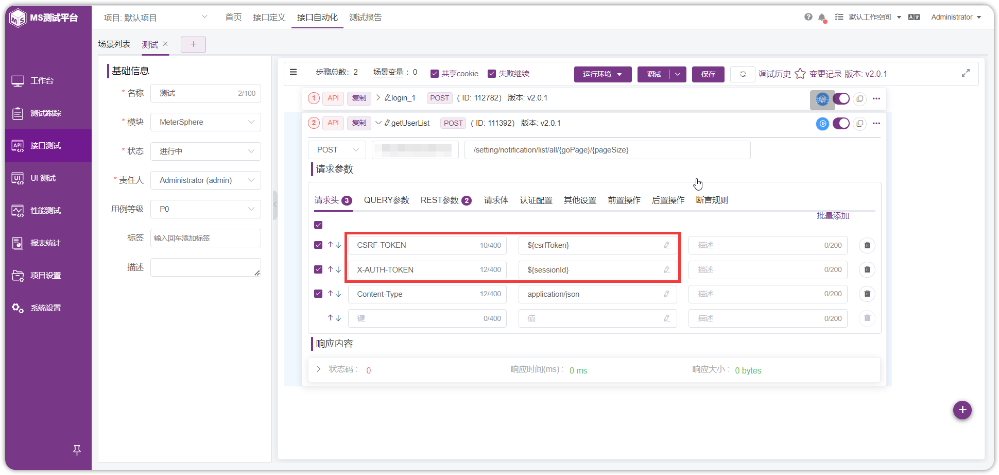

## 4 查看测试报告
### 4.1 执行场景用例
场景步骤添加完成后，点击场景步上方的的【调试】按钮，可在列表查看各个步骤执行状态，展开可查看接口执行的详细信息。

点击【调试历史】也可以直接查看详细的报告信息。

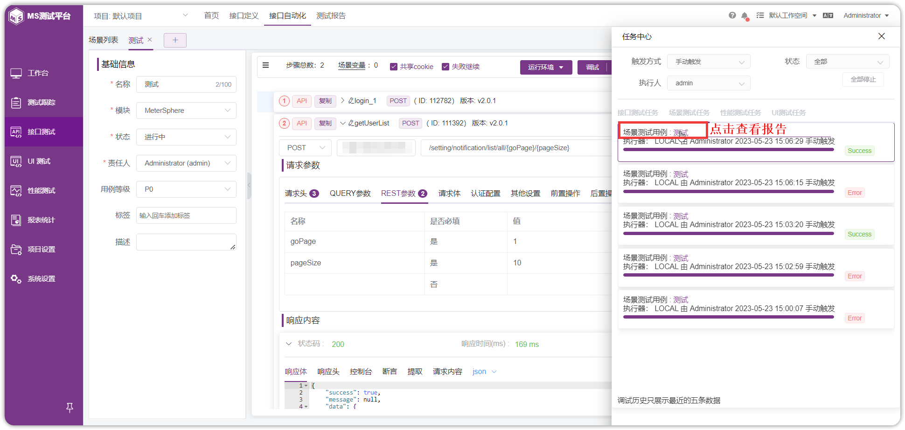

### 4.2 生成报告
点击场景步上方的【调试】 按钮旁边的【V】，选择【生成报告】，生成报告和查看场景报告的步骤详细信息。
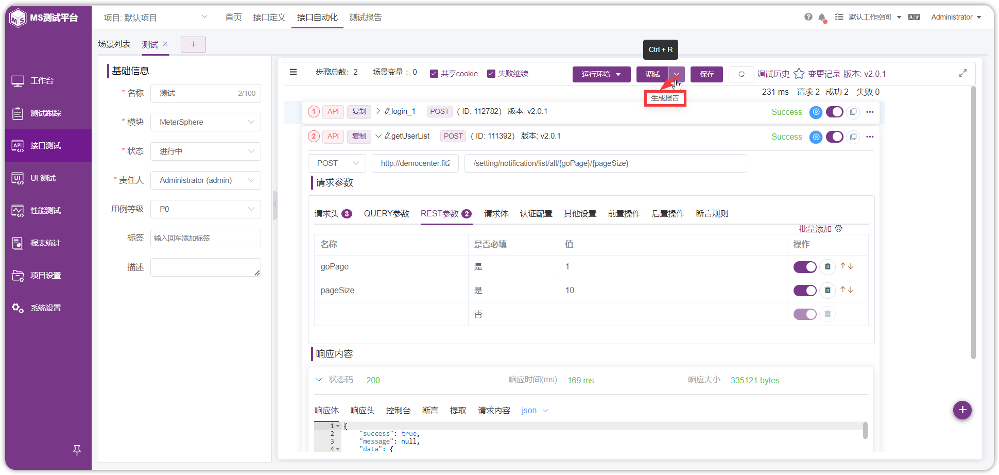

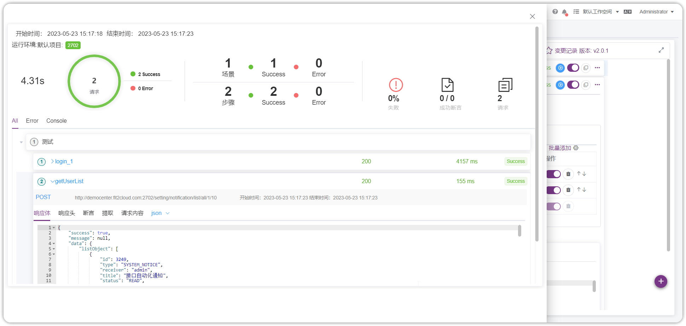

也可以直接在【测试报告】列表点击右侧【报告详情】查看报告详细信息。
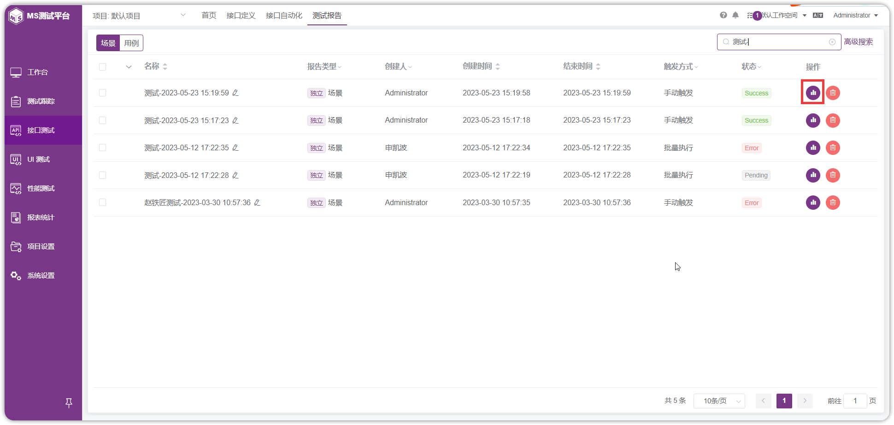

在报告列表中选择报告【详情】按钮打开【测试报告】页面，在页面中可以查看报告详情，分享和导出报告。
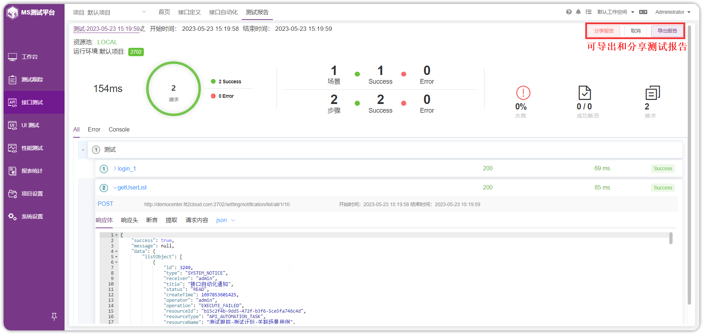
