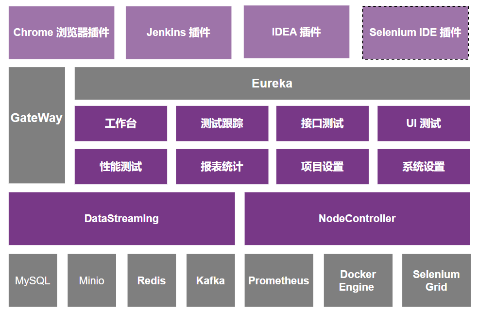
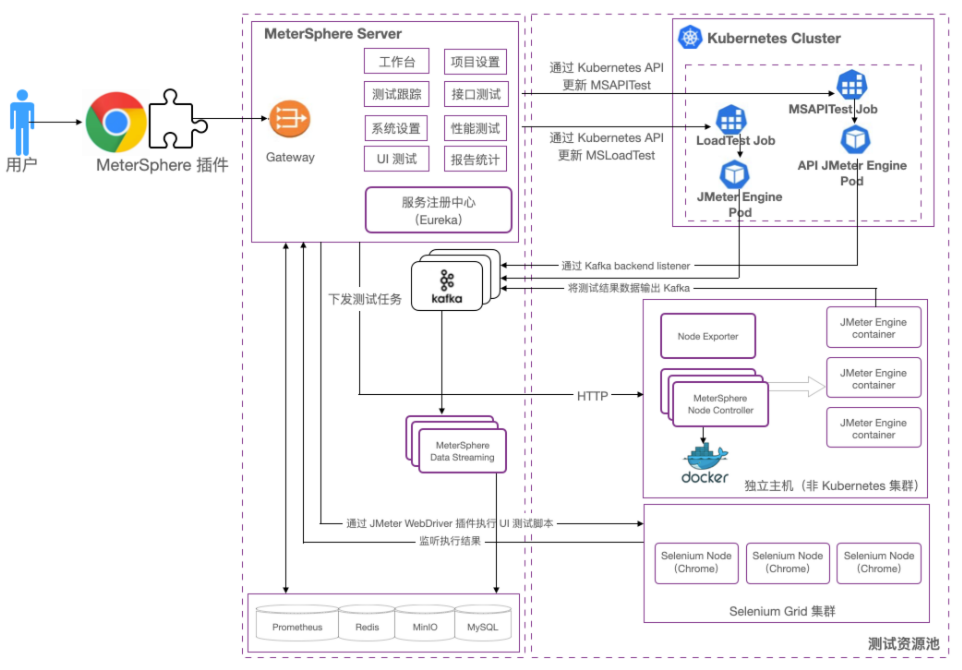
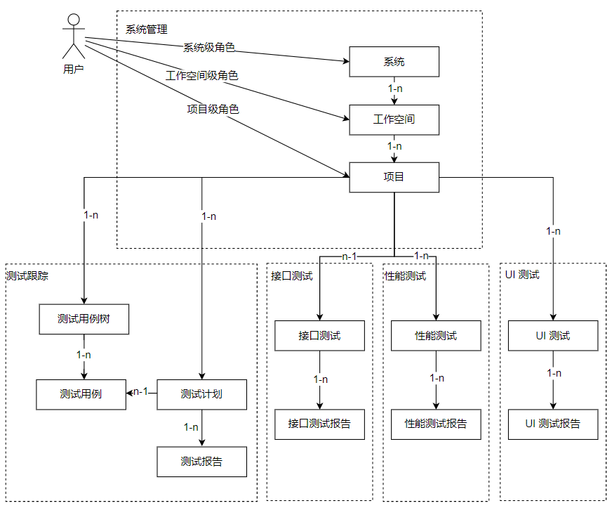

## 1 整体架构

!!! ms-abstract "组件说明"

    - **[Chrome 浏览器录制插件](https://github.com/metersphere/chrome-extensions)**: 录制 Web 访问请求生成 JMeter 脚本并导入到 MeterSphere 中用于接口测试及性能测试。
    - **[Jenkins 插件](https://github.com/metersphere/jenkins-plugin)**: 在 Jenkins 中安装该插件后可将 Jenkins 任务中添加 MeterSphere 构建环节,用户在该构建环节中配置 MeterSphere 平台的认证信息后,可选择指定项目下的接口/性能测试进行触发执行。
    - **[IDEA 插件](https://github.com/metersphere/metersphere-idea-plugin)**: IDEA 插件,基于javadoc解析,能够自动识别类,同步接口定义到 MeterSphere。
    - **[GateWay](https://github.com/metersphere/metersphere)**: API 网关项目。
    - **[Eureka](https://github.com/metersphere/metersphere)**: 服务注册中心。
    - **[工作台](https://github.com/metersphere/metersphere)**: MeterSphere 项目的工作台模块。
    - **[项目设置](https://github.com/metersphere/metersphere)**: MeterSphere 项目的项目设置模块。
    - **[测试跟踪](https://github.com/metersphere/metersphere)**: MeterSphere 项目的测试跟踪模块。
    - **[接口测试](https://github.com/metersphere/metersphere)**: MeterSphere 项目的接口测试模块。
    - **[UI 测试](https://github.com/metersphere/metersphere)**:  MeterSphere 项目的UI 测试模块。
    - **[性能测试](https://github.com/metersphere/metersphere)**: MeterSphere 项目的性能测试模块。
    - **[系统设置](https://github.com/metersphere/metersphere)**: MeterSphere 项目的系统设置模块。
    - **[报告统计](https://github.com/metersphere/metersphere)**: MeterSphere 项目的报告统计模块。
    - **[Node Controller](https://github.com/metersphere/node-controller)**: 为接口或者性能测试提供独立节点类型的测试资源池。
    - **MySQL**: MeterSphere 项目的主要数据均存储在 MySQL。
    - **Redis**: MeterSphere 项目登录用户的 Session 和任务队列信息存储在 Redis。
    - **Minio**: MeterSphere 项目的分布式对象存储模块。
    - **Kafka**: 接收 JMeter 产生的接口测试或者性能测试的结果数据。
    - **Prometheus**: 收集压力机及被测系统的监控数据。
    - **[Data Streaming](https://github.com/metersphere/data-streaming)**: 从 Kafka 中获取接口测试或者性能测试结果数据进行处理后存入 MySQL 数据库。
    - **Docker Engine**: 为 Node Controller 提供 JMeter 容器运行环境。
    - **Selenium Grid**: 为 UI自动化测试提供运行环境,支持分布式拓展。

!!! ms-abstract ""
	各个组件间的关系可参考下图： 

## 2 管理模型
!!! ms-abstract ""
	MeterSphere 提供了多租户、多角色的管理模型, 用户可根据所在团队的实际情况进行灵活的租户体系映射。

    - **系统**: 每个独立部署的 MeterSphere 即称为一套系统。
    - **系统级角色**: 角色的权限范围为整个系统, 常见的角色如系统管理员, 可管理整个系统内的租户、用户及测试资源, 同时可变更修改系统级配置参数。
    - **工作空间**: MeterSphere 中的一级租户, 可映射为不同的部门或者产品线。
    - **工作空间级角色**: 角色的权限范围限定在某个工作空间当中, 常见的角色如工作空间管理员及普通用户, 可在工作空间中创建项目、发起测试、查看测试报告等。
    - **项目**: 以项目纬度管理各种类型测试数据，各个项目间数据隔离。
    - **项目级角色**: 角色的权限范围限定在某个项目当中, 常见的角色如项目管理员、项目成员、只读用户等，可在项目中创建、修改、执行测试计划、功能测试用例、接口测试用例、性能测试用例、查看测试报告等。
    - **自定义角色**: 可创建不同所属类型的自定义角色，满足更多样化的团队管理及在线协作。

## 3 技术栈
!!! ms-abstract ""

    - 后端: [Spring Cloud](https://www.tutorialspoint.com/spring_cloud/spring_cloud_introduction.htm)
    - 前端: [Vue.js](https://vuejs.org/)
    - 中间件: [MySQL](https://www.mysql.com/), [Kafka](https://kafka.apache.org/), [Redis](https://redis.io/), [Minio](https://min.io/), [Prometheus](https://prometheus.io/)
    - 基础设施: [Docker](https://www.docker.com/), [Kubernetes](https://kubernetes.io/)
    - 测试引擎: [JMeter](https://jmeter.apache.org/)
