## 1 切换语言
点击页面右上方的语言下拉菜单，进行指定语言的切换。
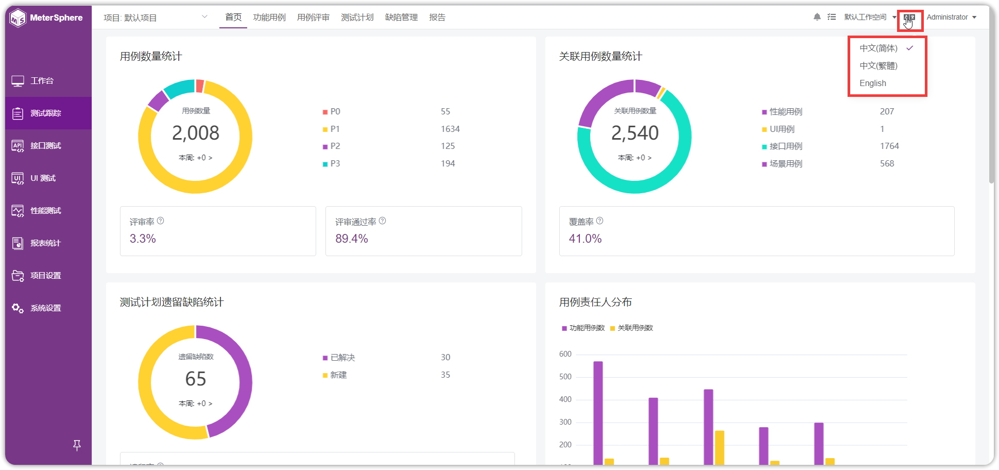

## 2 切换工作空间
工作空间的概念说明及关系请参考 [概念说明](../system_arch.md#_4)。

页面右上方展示了用户当前所处的工作空间。点击工作空间下拉菜单，菜单中列出了当前用户具有权限的工作空间列表，点击某个工作空间进行切换。
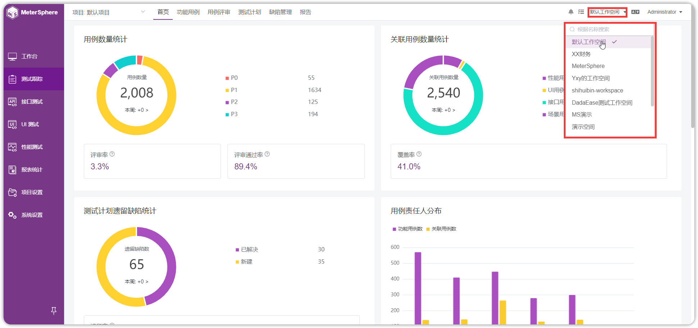

## 3 切换项目
MeterSphere 中的测试用例、接口定义、性能测试等资源均使用项目进行隔离，用户需要操作另一个项目中的资源时需要先进行项目切换。

点击左上方的项目下拉菜单，菜单中列出了当前工作空间下的项目列表，点击某个项目进行切换。
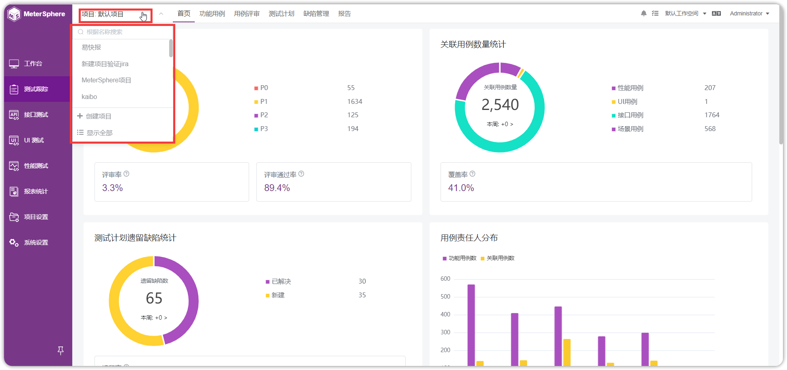

## 4 批量操作
系统中的大部分列表均提供了多选及全选功能，当选中多个数据后可以点击【批量处理】按钮进行批量操作。
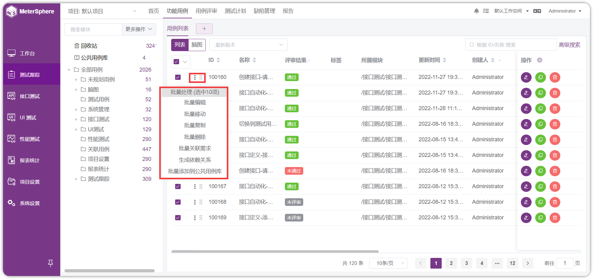

为了更方便的进行全选操作，系统提供了两种全选模式。点击列表左上方全选框旁边的下拉按钮，选择【选择可见数据】选项，该方式只选中当前分页中可见的数据条目。选择【选择所有数据】项，该方式选中当前列表所有分页中的数据条目。

!!! info "说明"
    直接点击全选框不下拉选择时默认使用【选择可见数据】方式。

## 5 查询管理
在所有列表信息页面，系统都会提供查询功能，查询功能一般有单一查询，或同时提供单一查询和高级查询。

### 5.1 单一查询
单一查询：一般按ID、名称等信息模糊查询，并且在查询输入框内有相应条件的说明，如下图

### 5.2 高级查询
在部分列表信息页面的右上角会提供高级查询功能。
点击【高级查询】可看到提供的多种条件的组合查询。不同页面的高级查询条件不一样，下面举例的是功能用例列表中的高级查询页面。
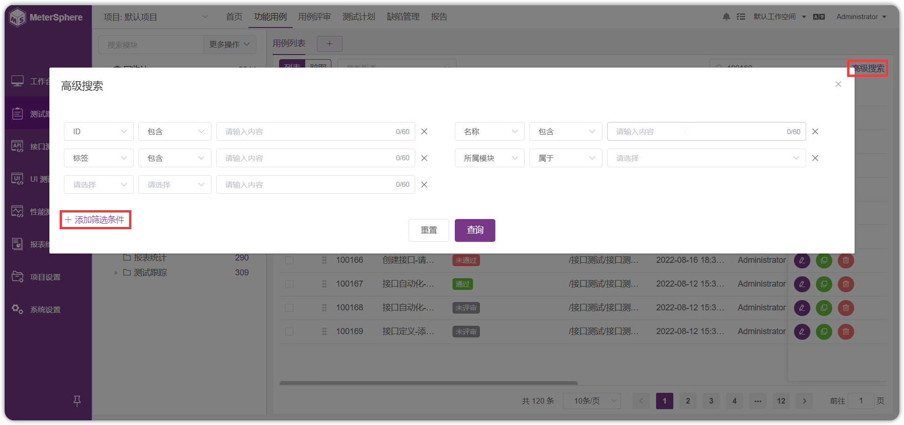

## 6 表头功能
列表模式下，在信息列表头上提供了其他相关功能：比如查询、列表信息显示设置等。

### 6.1 复选框功能
在列表信息页的第一列复选框头部，有个向下箭头【V】，点击向下箭头【V】可以看到对于记录的选中提供两种选择数据范围，即对当前页，或对查询到的所有记录。
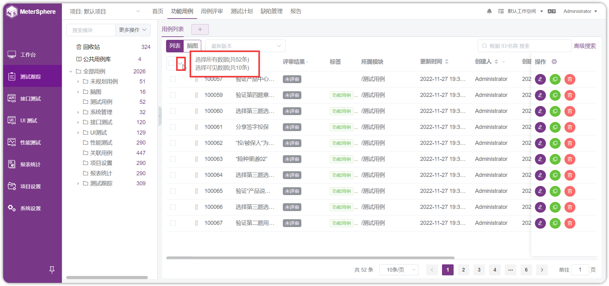

### 6.2 列表内查询
在列表信息头中，如果表头信息有向下箭头【V】，则表示在当前的列表信息集中，可以根据此信息进行快速筛选查询。

### 6.3 排序功能
在列表信息头中，如果表头信息有向上下箭头，则表示根据此字段对当前的列表信息集进行倒序和正序排列。系统一般提供多种信息的正序或倒序的排列。
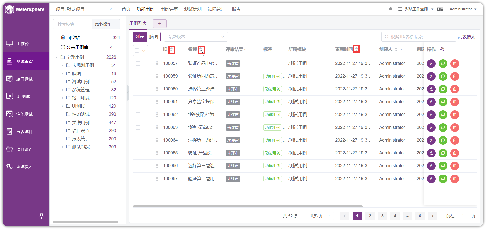

### 6.4 自定义列表显示
系统对于部分列表信息页面，都支持用户自定义列表显示信息的设置。
在信息列表的操作列，头部有【设置】按钮，可以自定义列表显示数据的字段。

下面以测试计划页面的设置为例，点击【设置】按钮，弹出表头显示字段设置，系统默认显示所有字段。
需要显示的字段移到右边已选字段框中；不需要显示的字段移到左边待选字段框中。
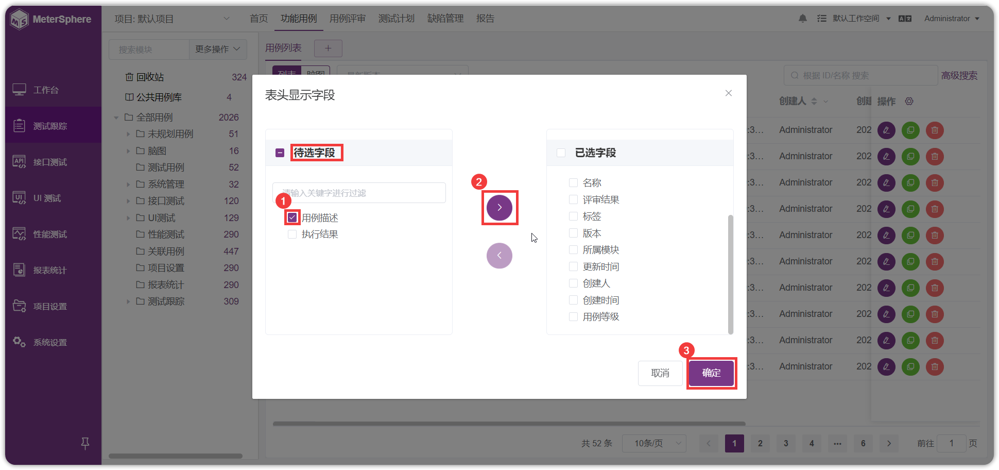

点击【确定】完成设置，系统会返回信息列表页面，此时系统会自动刷新信息列表页，此时按设置的信息进行显示。

### 6.5 调整列表宽度
点击列表表头列中间的【|】，可左右拖动自定义调整列表的宽度。
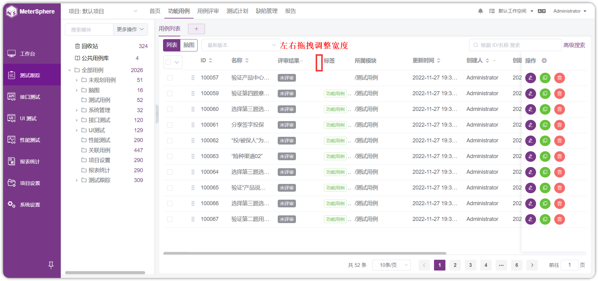

## 7 个人信息
在右上角用户名处的下拉菜单中，选择【个人信息】选项，可看当前个人相关的配置信息。
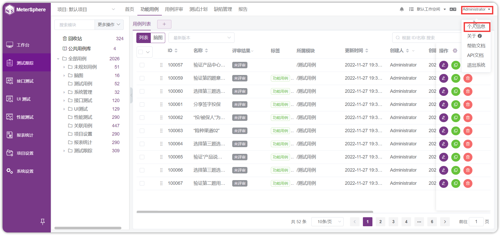

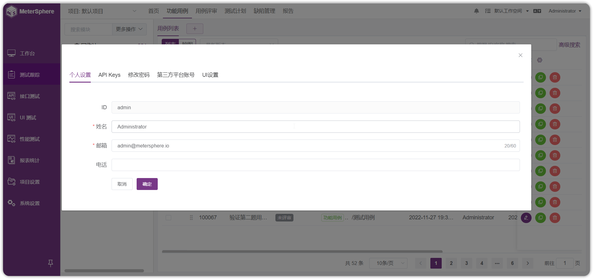

## 8 查看版本信息
在右上角用户名处的下拉菜单中，选择【关于】选项，在弹出的页面中可以查看当前版本信息。
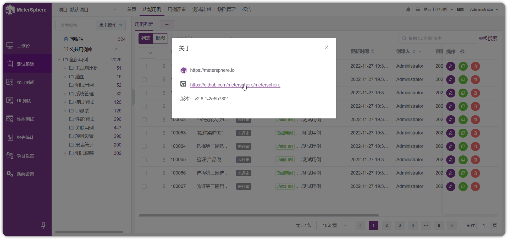

## 9 查看帮助文档
在右上角用户名处的下拉菜单中，选择【帮助文档】选项，浏览器将在新页面打开在线文档页面。
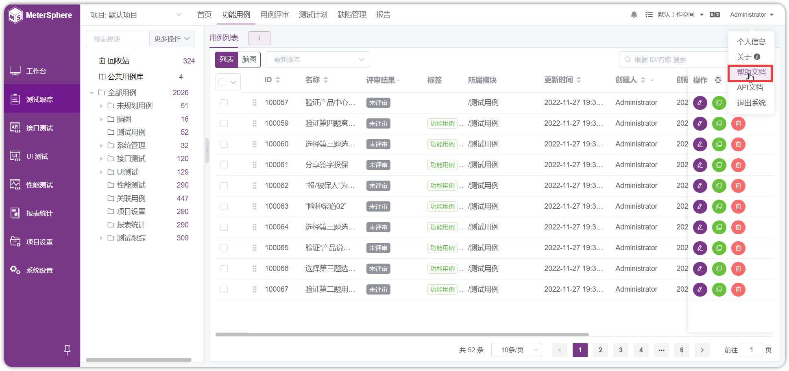

## 10 查看 API 文档
在右上角用户名处的下拉菜单中，选择【API文档】选项，浏览器将在新页面打开内置的 API 文档页面。
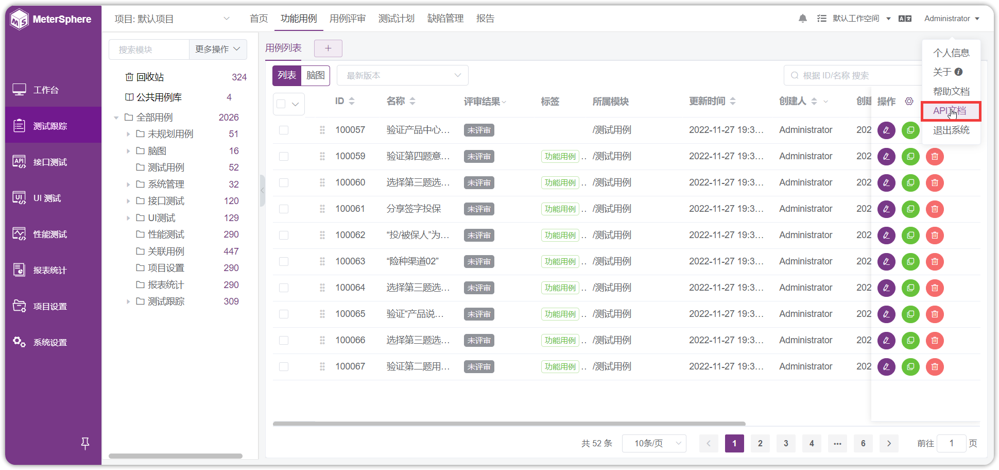

## 11 退出系统
在右上角用户名处的下拉菜单中，选择【退出系统】选项，页面将会跳到登录页面。
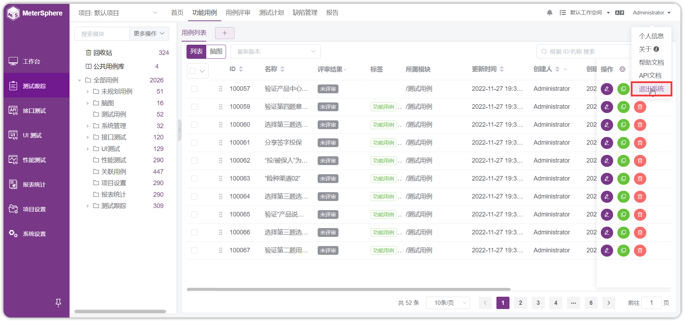