测试计划属于某个项目，并可关联该项目下的测试用例。测试计划用于将测试各环节不同类型的测试任务添加到一个测试计划中，包括功能测试、接口测试和性能测试等，支持实时展示各测试环节的进度及测试情况，并实时生成测试报告。

## 1 测试计划管理
测试计划可将测试各环节加入到一个测试计划中，包括功能测试、接口测试和性能测试等，能实时展示各测试环节的进度及测试情况，并实时生成测试报告。
点击【测试跟踪】,点击【项目】，点击测试计划，可查看当前项目中的测试计划。 

### 1.1 计划列表功能
####  1.1.1 列表头功能  
功能详细介绍及使用说明可参考 [通用功能->表头功能](../../general/#6)。

####  1.1.2 计划列表维护 
在测试计划列表信息页，鼠标点击某个计划，进入计划详情页面。
 

可以管理和维护本次计划测试的范围：功能测试用例、接口测试用例、场景测试用例、性能测试用例等。
 

####  1.1.3 测试报告查看  
计划执行后，可以点击【查看测试报告】。
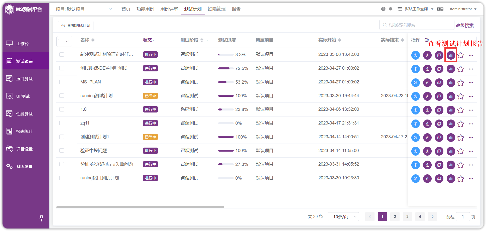 

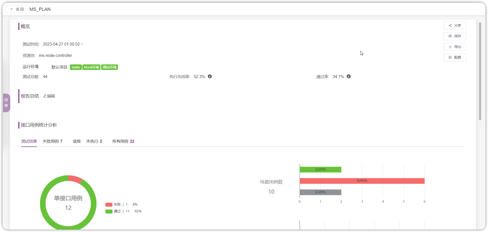

报告详细解读见 [测试跟踪->报告](../test_report/)。

### 1.2 维护管理计划
####  1.2.1 创建测试计划 

!!! info "点击【创建测试计划】，即可进入创建测试计划页面，页面内容包括："
    1. 计划名称、负责人、测试阶段等等必填信息
    2. 标签、计划开始/结束时间、备注等等信息
    3. 自动更新状态开关 等选择信息
    
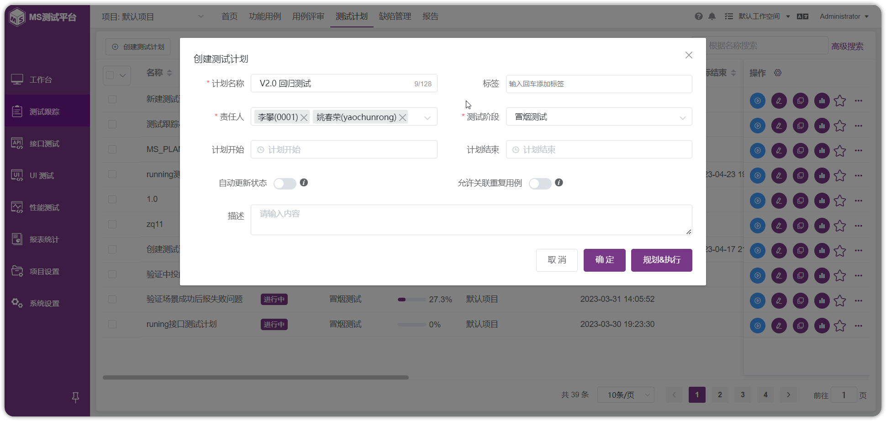 

- 点击【确定】完成创建测试计划，并且页面跳转到测试计划列表信息页面，可在测试计划列表中查看到创建的测试计划。
- 点击【规划&执行】完成创建测试计划，并且页面跳转到测试计划内容维护界面，可直接添加本次计划的测试范围和测试内容。

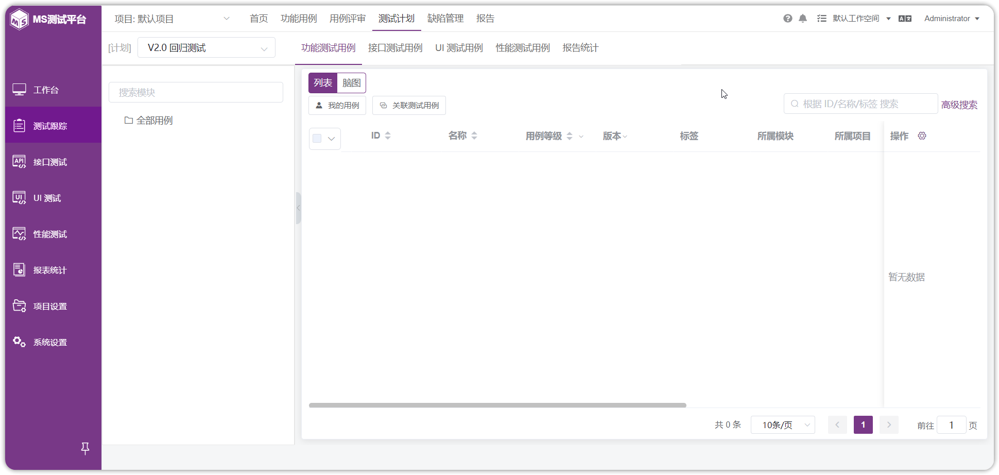 

####  1.2.2 维护测试计划 
在测试计划列表信息列表，点击某条计划，可以对测试计划详情进行维护；
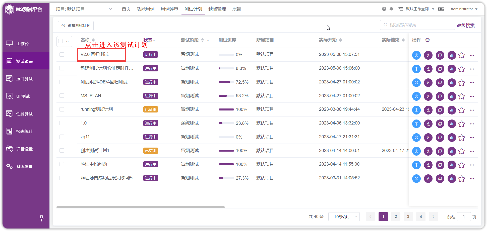 

添加本次计划测试的范围：功能测试用例、接口测试用例、场景测试用例、性能测试用例等；
 

- 点击【报告】按钮，可以查看测试计划的报告；
- 点击【执行】按钮，可以执行测试计划；
- 点击【...】按钮，在下拉操作菜单中，点击【删除】按钮，可以对测试计划进行删除；点击【定时任务】按钮，可以设置一个指定的执行时间；
- 点击【复制】按钮，可克隆原计划生成新的计划，同时可对此新计划进行正常的维护和操作。

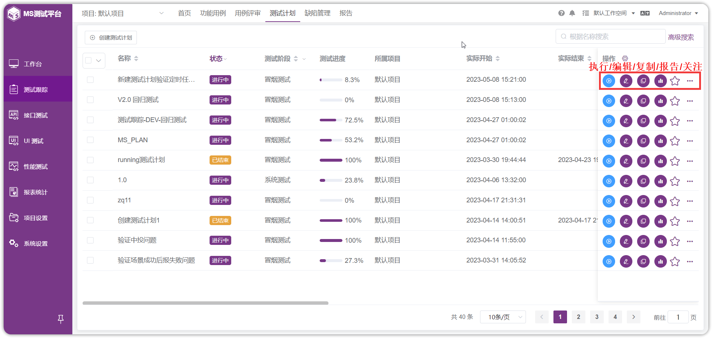 

点击【编辑】，修改测试计划的相关信息和当前状态；
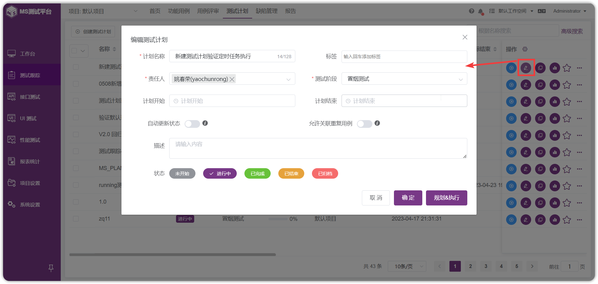 

!!! info "当前状态说明："
    1. 已完成：表示计划中所有的测试用例都通过了。
    2. 已结束：表示计划中执行结果有失败的，但是都执行完了。
    
!!! info "备注："
    此状态可由系统自动更新，也可以手动维护，手动改状态只是改测试计划的状态，里面的用例状态不会判断，也不会修改。

####  1.2.3 关联测试用例 
#####  为测试计划关联功能用例	
进入测试计划执行主页，默认打开功能测试用例标签。点击【关联测试用例】支持为测试计划关联功能用例，同时支持用户快速切换【我的用例】或【全部用例】列表。 
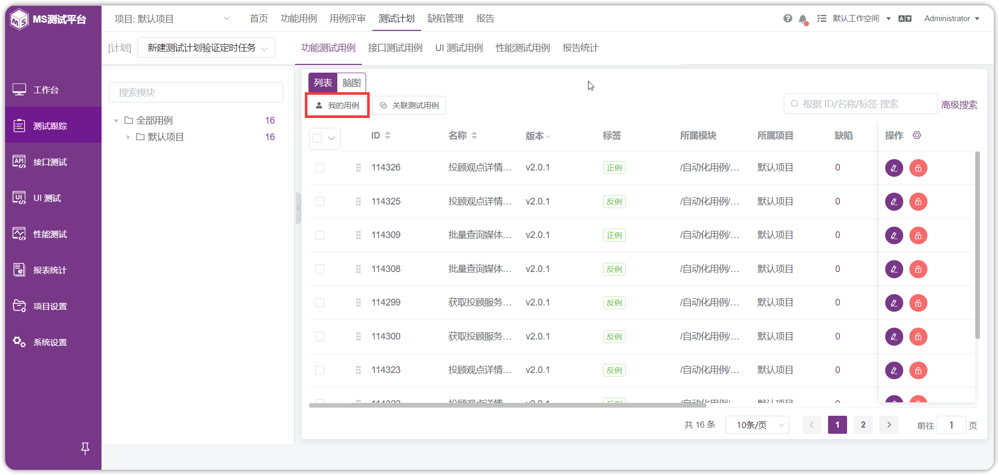

- 基于列表视图记录计划执行结果

功能测试用关联完成后，点击任意功能测试用例的【编辑】按钮，进入用例详情页面。在执行步骤中，填写每一步的实际结果及该步的执行结果，基于各步骤执行情况及评定标准，点击上方的状态按钮为此条用例标记执行状态。 
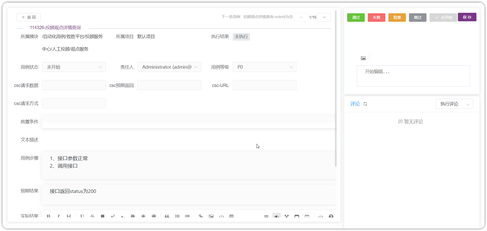

- 基于脑图视图记录计划执行结果

与用例的创建和评审类似，用例执行结果同样可以通过脑图方式记录。在用例列表页面点击【脑图】切换到脑图展示模式，选中待执行用例，通过添加标签的方式来标记用例执行结果。 
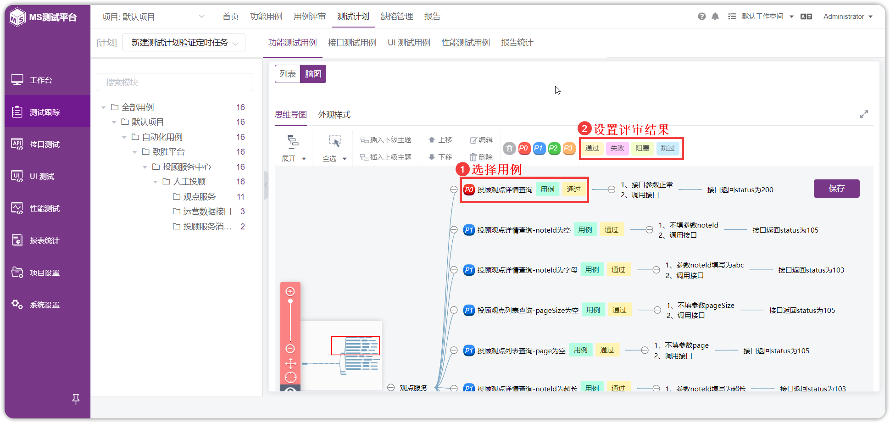

#####  为测试计划关联接口用例 		
点击【接口测试用例】,点击【接口用例】和【场景用例】，可进入不同类型接口用例的关联列表。
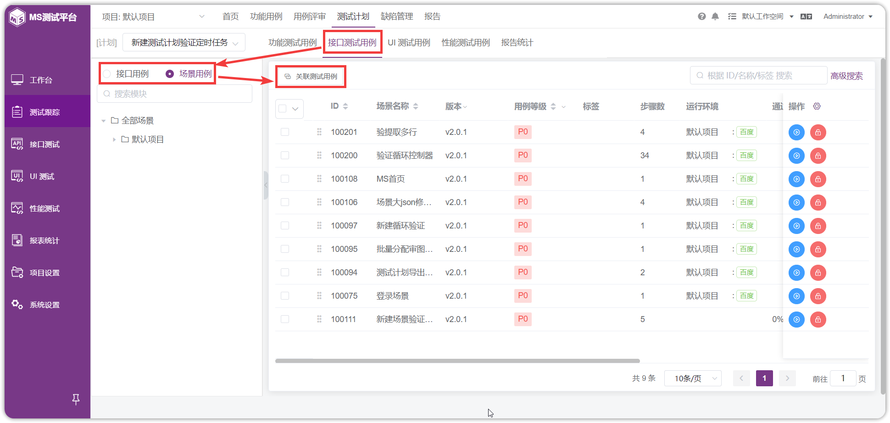

点击【关联测试用例】，进入关联接口用例页面，同时此也支持跨项目的接口测试用例和场景用例的引用。
勾选需要关联的测试用例后，同时需要选择运行环境，点击【确定】即可完成接口用例的关联操作。
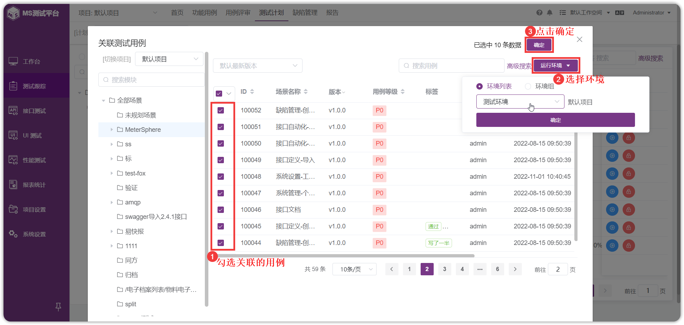

关联接口测试用例后，在测试用例列表中可点击【执行】，执行接口测试，执行完成后可点击【查看测试报告】查看测试结果。
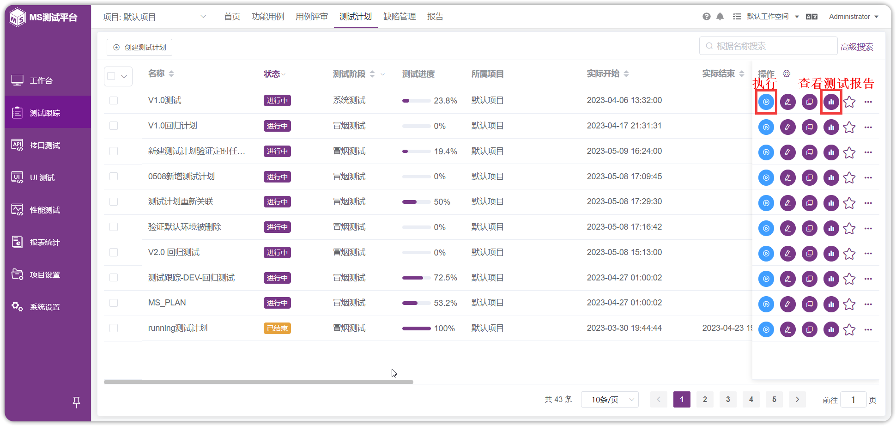

#####  为测试计划关联 UI 测试用例 (X-Pack)		
切换至【UI测试用例】标签视图，进入 UI 测试用例关联页面，点击【关联测试用例】按钮。
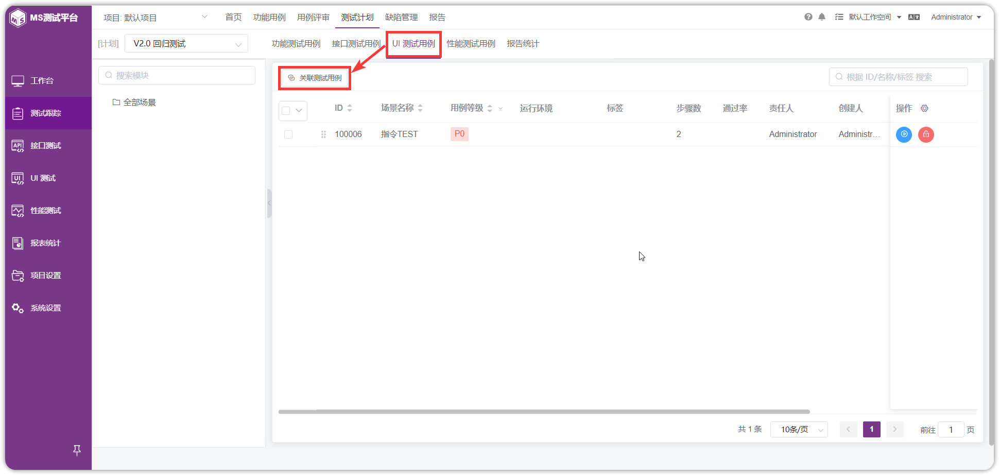

勾选要关联的 UI 测试用例，点击【确定】按钮即可。
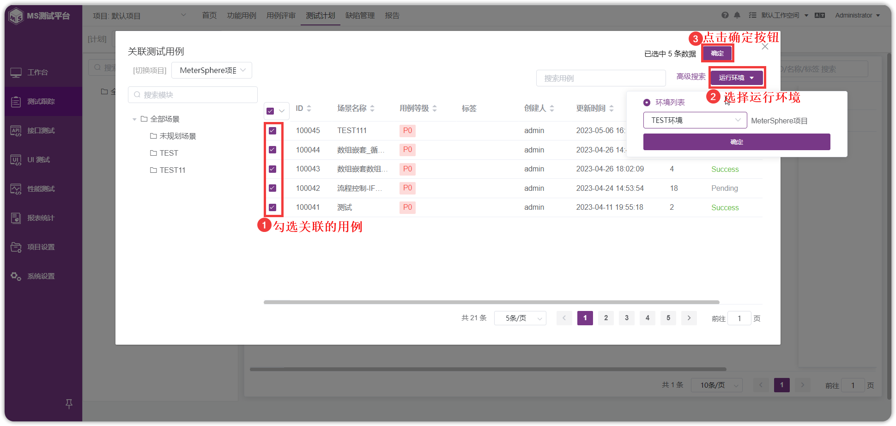

可看到 UI 测试用例页面，列表展示已经关联的用例
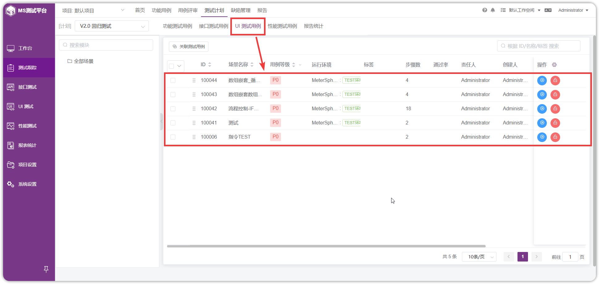

#####  为测试计划关联性能用例 		
切换至【性能测试用例】标签视图，支持用户为测试计划关联性能测试用例。用户可以在该页面发起单用例的快速执行、查看单用例执行结果，同时支持批量取消关联、批量执行等操作。目前，平台支持以并行或串行方式批量执行性能测试用例。 

#####  报告统计 	
切换至【报告统计】标签视图，可看到该测试计划的具体报告内容 
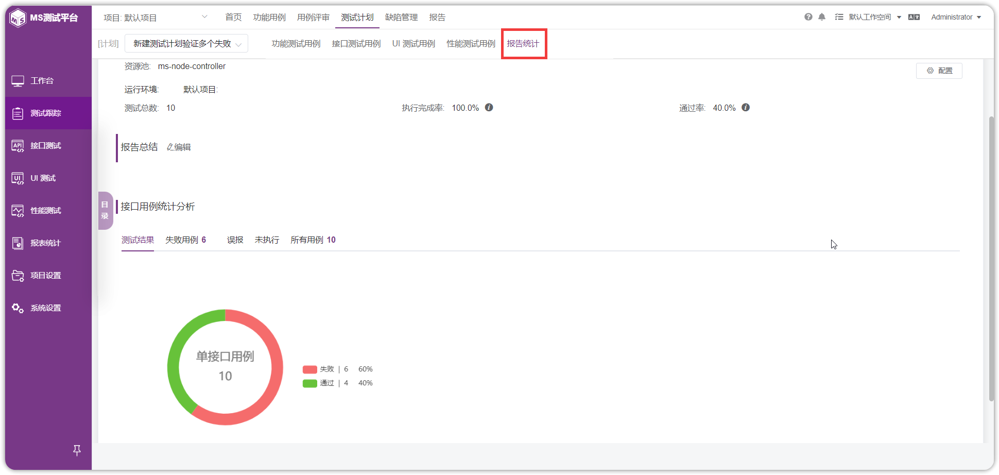

可自定义编写测试报告总结内容  
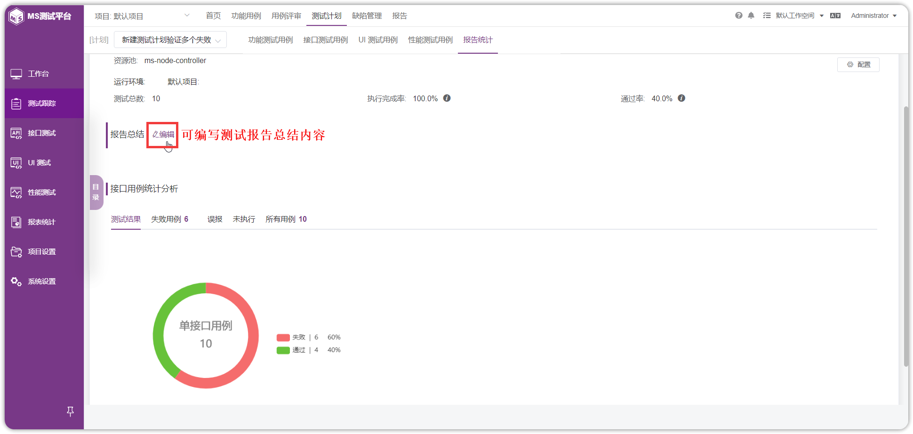

点击【分享】按钮，可复制该测试报告链接进行分享 
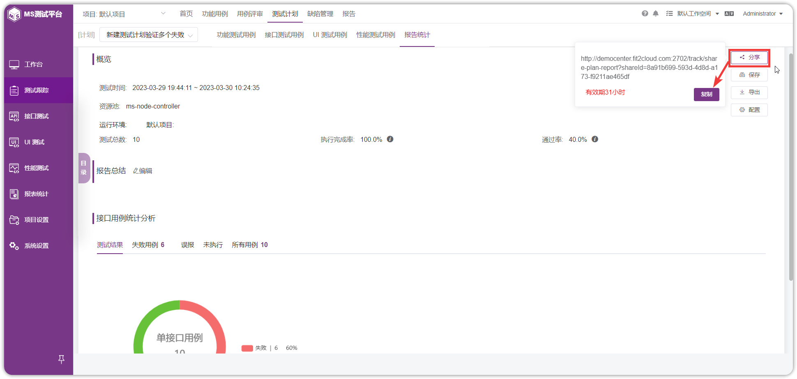

点击【配置】按钮，可自定义配置报告内容 

可保存当前测试报告，也可导出当前测试报告，导出的格式为 HTML 格式 
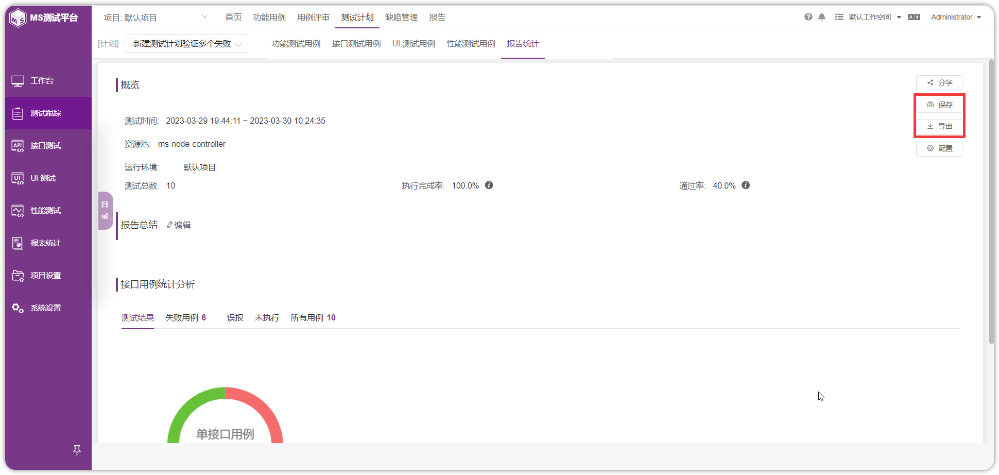

可切换不同测试计划查看报告统计，点击左侧目录，可查看报告统计目录 
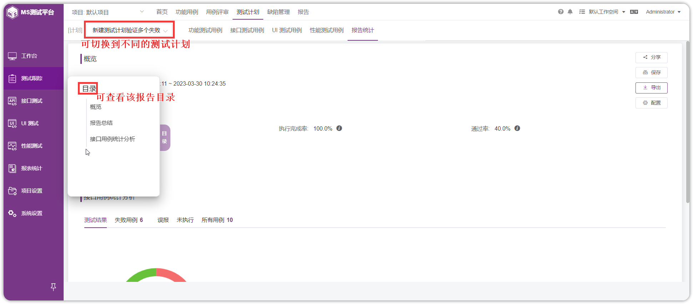

### 1.3 批量操作
####  1.3.1 批量开/关定时任务 
勾选多个测试计划后，点击批量开/关定时任务，可对设置好的定时任务进行开启/关闭。
	

####  1.3.2 批量执行 
勾选多个测试计划后，点击批量执行。
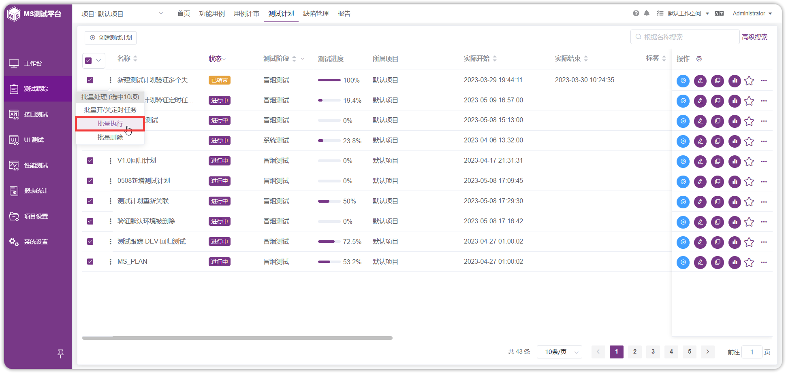	